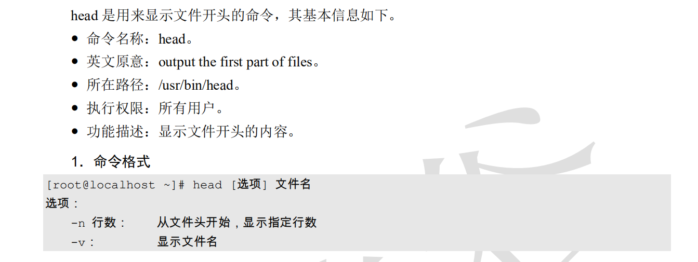
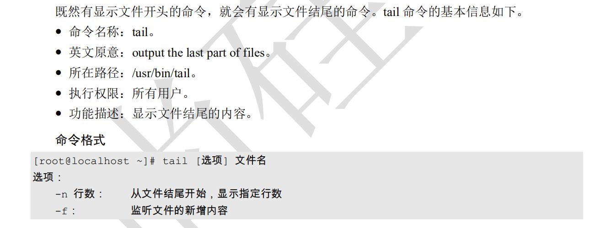
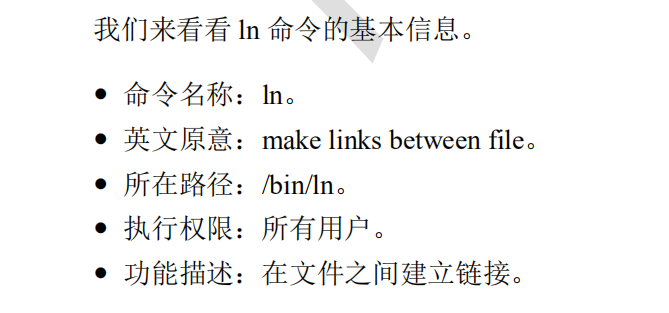
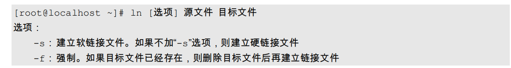
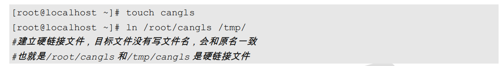
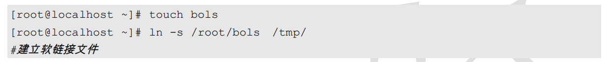
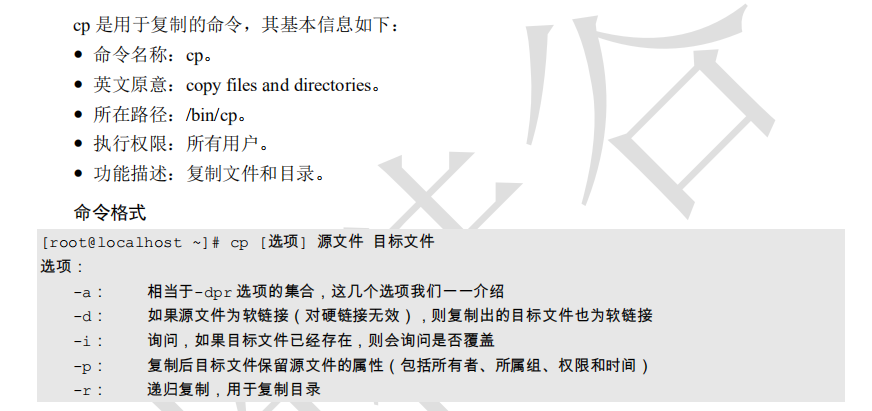
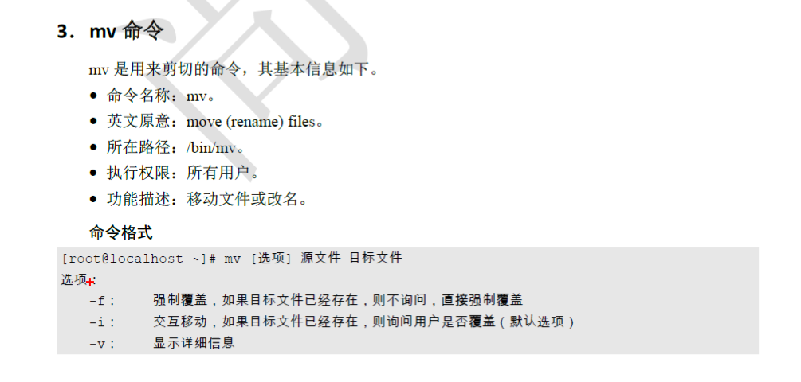

# Linux系统管理-Linux安装

### 1、VMware简介

VM是一个虚拟PC的软件，可以在现有的操作系统上虚拟一个新的硬件环境，相当于模拟出一台新的PC,以此来实现一台机器上真正同时运行两个独立的操作系统。

* VM的主要特点：
  * 不需要分区或者重新开机就能在同一台PC上使用两种以上的操作系统
  * 本机系统可以与虚拟机系统网路通信
  * 可以设定并且随时修改虚拟机操作系统的硬件环境

### 2、系统分区

* MBR分区表（主引导分区表）：最大支持2.1T硬盘，最多支持四个分区
  * 主分区：最多只能四个
  * 扩展分区：
    * 最多只能有一个
    * 主分区加扩展分区最多有4个
    * 不能写入数据，只能包含逻辑分区
  * 逻辑分区：
* GPT分区表(全局唯一标识分区表)：GPT分区支持9.4ZB硬盘（1ZB=102PB,1PB=1024EB，1EB=1024TB），理论上支持的分区数量没有限制，但是window上限制为128个主分区

#### 格式化：

​	逻辑格式化，它是根据用户选定的文件系统（如FAT16、FAT32，NTFS、EXT2、EXT3、EXT4），在磁盘的特定区域写入特定的数据，在分区中划出一片用户存放文件分配表，目录表等用户文件管理的磁盘空间。

#### 挂载点：

​	使用已经存在的空目录作为挂载点

#### 挂载

* 必须分区
  * /（根分区）
  * swap分区(交换分区)
    * 如果真实内存小于4GB，swap为内存的4G
    * 如果真实内存大于4GB，swap和内存一致
    * 实验环境，不大于2GB
* 推荐分区
  * /boot (启动分区,  1GB)
* 常用分区

#### 3、linux系统安装

#### 4、linux常用命令

* 命令的基本格式

  1、命令的提示符

  `[root@localhost ~]# ` 

* []:这是提示符的分隔符号，没有特殊的含义
* root:显示的是当前的登录用户
* @：分隔符号，没有特殊含义
* localhost:当前系统的简写主机名
* ~：代表用户当前所在目录。此例中用户当前所在的目录是家目录
* #：命令提示符。超级用户是#，普通用户是$。

2、命令的基本格式

命令  [选项] [参数]

ls 

二、目录操作命令

1、ls 命令 ：显示文件

2、cd 命令

cd:切换所在目录的命令，这个命令的基本信息如下：

命令名称：cd

英文原文：change direactory

 绝对路径和相对路径

绝对路径：以根目录为参照物，从根目录开始，一级一级进入目录

相对路径：以当前目录作为参照物，进行目录查找

3、pwd:显示当前在哪里

4、mkdir 命令

* 命令名称：mkdir 
* 英文原意：make directories
* 所在路径：/bin/mkdir
* 执行权限：所有用户
* 功能描述: 创建空目录

  命令格式：   mkdir [选项] 目录名

​	选项：

​		-p:递归建立所需目录

5、rmdir ：删除空目录

这个命令太笨，我们后续无论是删除文件还是目录，都会使用rm 命令

三、文件操作命令

1、touch 命令

创建空文件或修改文件时间，这个命令的基本信息如下：

* 命令名称：touch
* 英文原意：
* 功能描述：创建或者修改文件时间

2、stat命令:查看文件的基本信息

```java
[root@localhost ~]# stat abc
  文件："abc"
  大小：0         	块：0          IO 块：4096   普通空文件
设备：fd00h/64768d	Inode：33643003    硬链接：1
权限：(0644/-rw-r--r--)  Uid：(    0/    root)   Gid：(    0/    root)
环境：unconfined_u:object_r:admin_home_t:s0
最近访问：2019-12-27 21:38:29.388569690 +0800
最近更改：2019-12-27 21:38:29.388569690 +0800
最近改动：2019-12-27 21:38:29.388569690 +0800
创建时间：-

```

3、cat命令查看文件内容

功能描述：合并文件并打印输出到标准输出

4、more 命令

more是分屏显示的文件的命令，该命令会打开一个交互界面，可以识别一些交互命令。常用的交互命令如下：

* 空格键：向下翻页
* b:向上翻页。
* 回车键：向下滚动一行
* /字符串：搜索指定的字符串
* q:退出

5、less命令

less是分行显示命令，其他的跟more命令相似

6、head命令



7、tail命令



8、ln命令  









四、目录和文件都能操作的命令

1、 rm  命令

rm是强大的删除命令，不仅可以删除文件，也可以删除目录

* 命令名称：rm
* 英文原意：remove file or driectories
* 所在路劲：/bin/rm
* 执行权限：所有用户
* 功能描述：删除文件或目录

```txt
[root@localhost ~]# rm [选项] 文件或目录
选项：
	-f: 强制删除
	-i:交互删除，在删除前会咨询用户
	-r:递归删除，可以删除目录
```

2、cp命令

是复制命令



3、mv命令



五、linux常见的文件权限

```txt
drwxr-xr-x. 2 root root    6 Dec 27 17:09 123
```

`drwxr-xr-x` :总共10位。

第一位代表的是文件类型：

* "-":普通文件
* “b":快设备文件，存储设备就是这类文件，如分区文件/dev/sda1就是这种文件
* ”c"：字符设备文件。这也是一种特殊的设备文件，输入设备一般就是这种文件，如鼠标、键盘等
* “d":目录文件。linux中一切皆文件，所以目录也是文件的一种
* ”l":软链接文件。
* “p":管道符文件。这是一种非常少见的特殊设备文件
* ”s":套接字文件。这也是一种特殊设备文件，一些服务支持Socket访问，就会产生这样的文件。

第2~4位代表文件所有者的权限

* r:代表read，是读取权限

* w代表write，是写权限

* x:代表execute，是执行权限

  如果有字母代表有对应权限，如果是"-"，则代表没有对应的权限

第5~7位代表文件所属组的权限，第8~10位代表其他人的权限