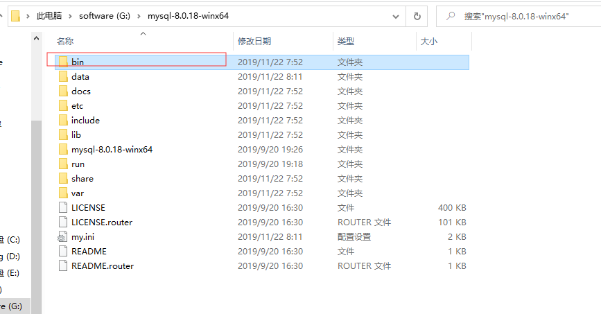
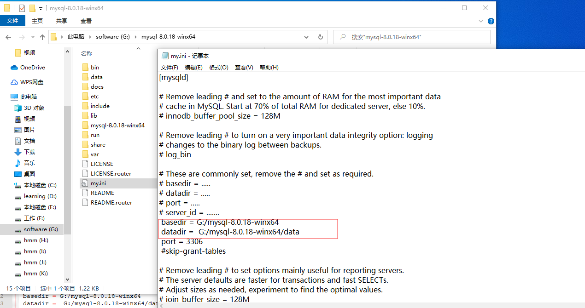

* 一、解压对应的zip文件`mysql-8.0.18-winx64.zip`

  

* 二、在解压的根目录下新建my.ini文件

  ​	

* 三、在bin目录下以管理员身份执行初始化和安装命令

  * 初始化： `./mysqld --initialize-insecure` 
  * `安装成windows服务：./mysqld --install mysql8.0` 

  * 启动mysql: ` net start mysql8.0` 

    ```txt
    PS G:\mysql-8.0.18-winx64\bin> ./mysqld --initialize-insecure
    PS G:\mysql-8.0.18-winx64\bin> ./mysqld --install mysql8.0
    Service successfully installed.
    PS G:\mysql-8.0.18-winx64\bin> net start mysql8.0
    mysql8.0 服务正在启动 ..
    mysql8.0 服务已经启动成功。
    
    PS G:\mysql-8.0.18-winx64\bin> msyql
    ```

  * 修改root的密码： `./mysqladmin -u root password 1234` 

    ```txt
    PS G:\mysql-8.0.18-winx64\bin> ./mysqladmin -u root password 1234
    mysqladmin: [Warning] Using a password on the command line interface can be insecure.
    Warning: Since password will be sent to server in plain text, use ssl connection to ensure password safety.
    ```

    

  * 登录mysql: ` ./mysql -u root -p`  回车后输入上面设置的密码

    

  * 验证是否成功：`show databases` 

  ```txt
  PS G:\mysql-8.0.18-winx64\bin> ./mysql -u root -p
  Enter password: ****
  Welcome to the MySQL monitor.  Commands end with ; or \g.
  Your MySQL connection id is 10
  Server version: 8.0.18 MySQL Community Server - GPL
  
  Copyright (c) 2000, 2019, Oracle and/or its affiliates. All rights reserved.
  
  Oracle is a registered trademark of Oracle Corporation and/or its
  affiliates. Other names may be trademarks of their respective
  owners.
  
  Type 'help;' or '\h' for help. Type '\c' to clear the current input statement.
  mysql> show databases;
  +--------------------+
  | Database           |
  +--------------------+
  | information_schema |
  | mysql              |
  | performance_schema |
  | sys                |
  +--------------------+
  4 rows in set (0.00 sec)
  
  mysql>
  ```

  四、解决yog连接mysql出现2058问题

  通过`mysql -u root -p` ,执行下面sql `ALTER USER 'root'@'localhost' IDENTIFIED WITH mysql_native_password BY 'password';`

