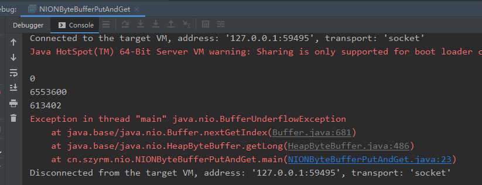
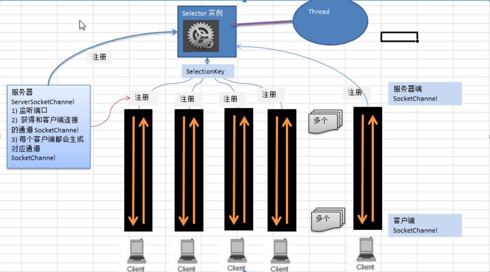
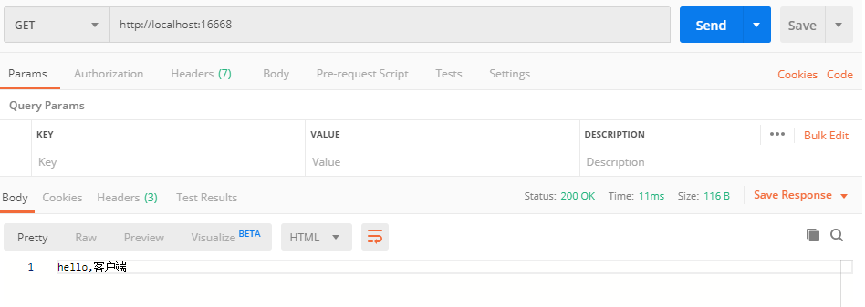

## netty学习

java中的IO模式主要有三种:BIO、NIO、AIO

#### 一、BIO

bio是一种同步阻塞的IO模式，其中每一个客户端对应服务端的一个线程。适合客户量小且固定的架构，编程比较简单。

#### 二、NIO 

NIO是一种同步非阻塞的IO模式。服务端采用一个线程来管理一个selector,每个selector来管理多个连接。selector就是一个多路复用器

* channel

  NIO的channel类似于流，但有些区别如下：

  * channel可以同时进行读写，而流只能读或只能写
  * channel可以实现异步读取数据
  * 通道可以从缓冲读取数据，也可以写数据到缓冲

  1、FileChannel用于文件的数据读写，DatagramChannel用于UDP数据的去写，ServerSocketChannel和SocketChannel用于TCP的数据读写。

  

  2、可以将一个普通的buffer转成一个只读buffer

  3、NIO还提供了MapperByteBuffer,可以让文件直接在内存中进行修改，而如何同步到文件由NIO来完成

  4、NIO还支持通过多个buffer完成读写操作，即SCattering和Gatering

  

* buffer

  Buffer和Channel的注意事项和细节

  * ByteBuffer支持类型化的put和get，put放入的是什么类型的数据，get就应该使用相应的数据类型来取出。否则就可能有BufferUnderFlowException异常。

    ```java
    public class NIONByteBufferPutAndGet {
        public static void main(String[] args) {
            ByteBuffer buffer = ByteBuffer.allocate(64);
    
    
            //类型方式放入数据
            buffer.putInt(100);
            buffer.putLong(9);
            buffer.putChar('尚');
            buffer.putShort((short) 4);
    
            //取出
            buffer.flip();
    
            System.out.println();
            System.out.println(buffer.getShort());
            System.out.println(buffer.getInt());
            System.out.println(buffer.getLong());
            System.out.println(buffer.getLong());
    
    
        }
    }
    ```

    

  * 可以将一个普通的buffer转成一个只读的buffer

    ```java
    package cn.szyrm.nio;
    
    import java.nio.ByteBuffer;
    
    /**
     * 将一个普通的buffer转换成只读后，就不能往里面放入数据
     */
    public class ReadOnlyBuffer {
        public static void main(String[] args) {
            ByteBuffer buffer = ByteBuffer.allocate(64);
            for(int i= 0;i<buffer.capacity();i++){
                buffer.put((byte) i);
            }
    
            //读取
            buffer.flip();
            ByteBuffer readOnlyBuffer = buffer.asReadOnlyBuffer();
    
            System.out.println(readOnlyBuffer.getClass());
    
    
            //读取
            while(readOnlyBuffer.hasRemaining()){
                System.out.println(readOnlyBuffer.get());
            }
            readOnlyBuffer.put((byte) 69);
    
        }
    }
    ```

  * 同时操作多个byteBuffer

    ```java
    package cn.szyrm.nio;
    
    import org.w3c.dom.ls.LSOutput;
    
    import java.io.IOException;
    import java.net.InetSocketAddress;
    import java.net.ServerSocket;
    import java.nio.ByteBuffer;
    import java.nio.channels.ServerSocketChannel;
    import java.nio.channels.SocketChannel;
    import java.util.Arrays;
    
    public class ScatteringAndGatheringTest {
        public static void main(String[] args) throws IOException {
            ServerSocketChannel channel = ServerSocketChannel.open();
            InetSocketAddress inetSocketAddress = new InetSocketAddress(7000);
    
            //绑定端口到socket，并启动
            channel.socket().bind(inetSocketAddress);
    
            //创建buffer数组
    
            ByteBuffer[] byteBuffers = new ByteBuffer[2];
            byteBuffers[0] = ByteBuffer.allocate(5);
            byteBuffers[1] =ByteBuffer.allocate(3);
    
            int messageLength = 8;
    
            //等待客户端链接
            SocketChannel accept = channel.accept();
    
            //循环读取数据
            while (true){
                int byteRead = 0;
                while (byteRead < messageLength ){
                    long read = accept.read(byteBuffers);
                    byteRead += read;
                    System.out.println("byteRead=" + byteRead);
                    //使用流打印，看看当前的这个buffer的position
                    Arrays.asList(byteBuffers).stream().map(buffer ->
                         "position=" + buffer.position() + ",limit=" + buffer.limit()
                    ).forEach(System.out::println);
                }
                //将所有的buffer进行flip
                Arrays.asList(byteBuffers).forEach(buffer->buffer.flip());
                long byteWrite = 0;
                while(byteWrite <messageLength){
                    long write = accept.write(byteBuffers);
    
                    byteWrite += write;
                }
    
                //将所有的buffer进行clear操作
                Arrays.asList(byteBuffers).forEach(buffer ->buffer.clear());
                System.out.println("byteRead=" + byteRead + " byteWrite=" + byteWrite + " messageLength=" + messageLength );
            }
    
    
        }
    }
    
    ```

    

* selector

  * 1)、Java的NIO，用非阻塞的IO方式。能够用一个线程，处理多个的客户端连接。
  * 2）、Selector能够检测到多个注册的通道上是否有事件发生:多个Channel以事件的方式可以注册到同一个Selector上。如果有事件发生，便获取事件然后针对每个事件进行相应的处理。这样就可以只用一个线程管理多个通道，及管理多个连接和请求。
  * 只有在连接真正有读写事件发生时，才会进行读写。就大大减少了系统开销，并且不必为每个连接都创建一个线程，不用去维护多个线程。
  * 避免了线程之间的上下文切换导致的开销

  selector类相关方法：

  Selector类时一个抽象类，常用方法和说明如下：

  ```java
  public static Selector open();//得到一个选择器对象
  ```

```java
public abstract int select(long timeout)；//监控所有注册的通道，当其中有IO操作可以进行时，将对应的SelectionKey加入到内部集合中并返回，参数用来设置超时时间。
```

```java
public abstract Set<SelectionKey> selectedKeys();//从内部集合中得到所有的SelectorKey
```

注意事项：

1)、NIO中的ServerSocketChannel功能类似于ServerSocket,SocketChannel功能类似Socket。

2）、selector相关方法说明

selector.select();//阻塞

selector.select(1000);//阻塞1000毫秒，在1000毫秒后返回

selector.wakeup();//唤醒seletor

selector.selectorNow()；//不阻塞，立马返回

NIO非阻塞网络编程原理分析图：

NIO非阻塞网络编程相关的（selector、sectionKey、ServerSocketChannel和SocketChannel）关系梳理图：



1、当客户端连接时，会通过ServerSocketChannel得到SocketChannel。

2、将SocketChannel注册到Selector上，

3、注册后返回一个SelectionKey，会和该Selector关联。

4、Seletor进行监听select方法，返回有事件的通到个数

5、进一步得到各个SelectionKey（有事件发生）

6、再通过SelectionKey反向获取SocketChannel channel();

7、可以通过得到的Channel，完成业务处理

一、NIO非阻塞网络编程快速入门

案例要求：

1)、编写一个NIO入门案例，实现服务器端和客户端之间的数据简单通讯

2）、目的：理解NIO非阻塞网路编程机制

```java
//NIOServer
package cn.szyrm.nio;

import java.io.IOException;
import java.net.InetSocketAddress;
import java.nio.ByteBuffer;
import java.nio.channels.SelectionKey;
import java.nio.channels.Selector;
import java.nio.channels.ServerSocketChannel;
import java.nio.channels.SocketChannel;
import java.util.Iterator;
import java.util.Set;

/**
 * NIO编程的
 */
public class NIOServer {
    public static void main(String[] args) {
        try (ServerSocketChannel serverSocketChannel = ServerSocketChannel.open()) {
            Selector selector = Selector.open();
            serverSocketChannel.socket().bind(new InetSocketAddress(6666));
            //设置为非阻塞
            serverSocketChannel.configureBlocking(false);
            
            serverSocketChannel.register(selector, SelectionKey.OP_ACCEPT);
            while(true){
                if(selector.select(1000) == 0){
                    System.out.println("服务器等待了1秒,无连接");
                    continue;
                }
                Set<SelectionKey> selectionKeys = selector.selectedKeys();
                Iterator<SelectionKey> keyIterator = selectionKeys.iterator();
                while(keyIterator.hasNext()){
                    //获取到selectionKey
                    SelectionKey next = keyIterator.next();
                    //根据key 对应的通道法僧的事件做出相应的处理
                    if(next.isAcceptable()){
                        //为该客户端生成一个SocketChannel
                        SocketChannel socketChannel = serverSocketChannel.accept();
                        socketChannel.configureBlocking(false);
                        System.out.println("客户端连接成功，生成了一个socketChannel["+socketChannel.hashCode() + "]");
                        //将socketChannel 注册到selector，关注事件为OP_READ,同时给SocketChannel 关联一个buffer
                        socketChannel.register(selector,SelectionKey.OP_READ, ByteBuffer.allocate(1024));

                    }else if(next.isReadable()){
                        //通过key反向获取对应的channel
                       SocketChannel channel = (SocketChannel) next.channel();
                       //获取到该channel关联的buffer
                        ByteBuffer buffer = (ByteBuffer) next.attachment();
                        channel.read(buffer);
                        System.out.println("from 客户端:" + new String(buffer.array()));
                    }
                    //手动从集合中将key移除
                    keyIterator.remove();
                }

            }

        } catch (IOException e) {
            e.printStackTrace();
        }
    }
}

```

```java
//NIOClient
package cn.szyrm.nio;

import java.io.IOException;
import java.net.InetSocketAddress;
import java.nio.ByteBuffer;
import java.nio.channels.SocketChannel;

public class NIOClient {
    public static void main(String[] args) throws IOException {
        //获得一个网络通道
        SocketChannel channel = SocketChannel.open();

        //提供服务端的ip和端口
        InetSocketAddress inetSocketAddress = new InetSocketAddress("127.0.0.1", 6666);

        //设置为非阻塞
        channel.configureBlocking(false);
        //连接服务器
        if(!channel.connect(inetSocketAddress)){
            while(!channel.finishConnect()){
                System.out.println("因为连接需要时间,客户端不会阻塞，可以做其他的工作");
            }
        }
        String str = "hello,world";
        ByteBuffer buffer = ByteBuffer.wrap(str.getBytes("UTF-8"));
        //发送数据
        channel.write(buffer);
        System.in.read();
    }
}

```

二、NIO网络编程应用实例--群聊系统

实例要求：

1、编写一个NIO群聊系统，实现服务器端和客户端之间的数据简单通讯（非阻塞）

2、实现多人群聊

3、服务端：可以检测用户上线,离线并实现消息转发功能

4、客户端：通过Channel可以五阻塞发送消息给其他用户，同时可以接受其它所有用户发送的消息(由服务器妆发得到)

5、目的：进一步理解NIO非阻塞网络编程

```java
//
public class GroupChatServer {
    private Selector selector;
    private ServerSocketChannel listenChannel;
    private static final int PORT = 6667;

    public GroupChatServer() {
        try {
            //获得选择器
            selector = Selector.open();
            //获得ServerSecketChannel
            listenChannel = ServerSocketChannel.open();

            listenChannel.socket().bind(new InetSocketAddress(PORT));
            listenChannel.configureBlocking(false);
            listenChannel.register(selector, SelectionKey.OP_ACCEPT);


        }catch (Exception e){

        }
    }

    public void listen(){
        try {
            while (true){
                int count = selector.select(2000);
                if(count >0){
                    //遍历selectionkey集合
                    Set<SelectionKey> selectionKeys = selector.selectedKeys();
                    Iterator<SelectionKey> keyIterator = selectionKeys.iterator();
                    while (keyIterator.hasNext()){
                        SelectionKey key = keyIterator.next();
                        if(key.isAcceptable()){
                            SocketChannel sc = listenChannel.accept();
                            sc.configureBlocking(false);
                            sc.register(selector,SelectionKey.OP_READ);
                            System.out.println(sc.getRemoteAddress() + "上线");

                        }
                        if(key.isReadable()){
                            //通道是可读的
                            readData(key);
                        }
                        //手动删除key
                        keyIterator.remove();

                    }
                }else{
                   // System.out.println("等待....");
                }
            }
        }catch (Exception e){

        }finally {

        }
    }
    //读取客户端消息

    private void readData(SelectionKey key){
        SocketChannel channel = null;
        try {
           channel = (SocketChannel) key.channel();
           //创建buffer
            ByteBuffer buffer = ByteBuffer.allocate(1024);
            int count = channel.read(buffer);
            if(count > 0){
                String msg = new String(buffer.array(), "UTF-8");
                System.out.println("from 客户端:" + msg);
                //向其他客户端转发消息
                sendInfoToOtherClients(msg,channel);
            }


        }catch (IOException e){
            try {
                System.out.println(channel.getRemoteAddress() + "离线了");
                //取消注册
                key.cancel();
                //关闭通道
                channel.close();;
            } catch (IOException ex) {
                ex.printStackTrace();
            }
        }
    }
    //转发消息给其他客户端
    private void sendInfoToOtherClients(String msg,SocketChannel self) throws IOException {
        System.out.println("服务器转发消息");
        //遍历所有注册到selector上的SocketChannel，并排除self
        for(SelectionKey key:selector.keys()){
            //通过key 取出对应的socketChannel
            SelectableChannel channel = key.channel();

            //排除自己
            if( channel instanceof SocketChannel && channel != self){
                    SocketChannel  dest = (SocketChannel) channel;
                    //将msg存储到buffer
                ByteBuffer wrap = ByteBuffer.wrap(msg.getBytes("UTF-8"));
                //将buffer的数据写入到通道
                int write = dest.write(wrap);

            }
        }
    }

    public static void main(String[] args) {
            //创建一个服务器对象
        GroupChatServer server = new GroupChatServer();
        server.listen();
    }

}

```

```java


public class GroupChatClient {
    private static final String HOST = "127.0.0.1";
    private static  final int PORT = 6667;
    private Selector selector;
    private SocketChannel socketChannel ;
    private String userName;

    public GroupChatClient() throws IOException {
        selector = Selector.open();
        socketChannel = SocketChannel.open(new InetSocketAddress(HOST,PORT));
        socketChannel.configureBlocking(false);
        socketChannel.register(selector, SelectionKey.OP_READ);
        //得到username
        userName = socketChannel.getLocalAddress().toString().substring(1);
        System.out.println(userName + "  is ok....");

    }

    //向服务器发送消息
    public void sendInfo(String info){
       info =   userName + " 说:" + info ;
        try {
            socketChannel.write(ByteBuffer.wrap(info.getBytes("UTF-8")));
        } catch (IOException e) {
            e.printStackTrace();
        }

    }

    //读取从服务端回复的消息
    public void readInfo(){
        try {
            int readChannels = selector.select();
            if(readChannels > 0){
                Iterator<SelectionKey> iterator = selector.selectedKeys().iterator();
                while (iterator.hasNext()){
                    SelectionKey key = iterator.next();
                    if(key.isReadable()){
                        //得到相关的通道
                        SocketChannel sc = (SocketChannel) key.channel();

                        ByteBuffer b = ByteBuffer.allocate(1024);
                        sc.read(b);
                        String msg = new String(b.array());

                        System.out.println(msg.trim());
                    }
                    //删除当前的key
                    iterator.remove();
                }

            }else{
             //   System.out.println("没有可用的通道");
            }
        } catch (IOException e) {
            e.printStackTrace();
        }
    }

    public static void main(String[] args) throws IOException {
        GroupChatClient groupChatClient = new GroupChatClient();
        //启动一个线程，每隔3秒，读取从服务器发送过来的数据
        new Thread(()->{
            while (true){
                groupChatClient.readInfo();
                try {
                    Thread.sleep(3000);
                } catch (InterruptedException e) {
                    e.printStackTrace();
                }
            }
        }).start();
        //发送数据给服务端
        Scanner scanner = new Scanner(System.in);
        while(scanner.hasNextLine()){
            String msg = scanner.nextLine();

            groupChatClient.sendInfo(msg);
        }

    }
}

```


### NIO与零拷贝

##### 零拷贝基本介绍

1）、零拷贝是网络编程的关键，很多性能优化都离不开

2）、在java程序中，零拷贝有mmap(内存映射)和sendFile。那么他们在系统中，到底是一个怎么样的设计？我们分析mmap和sendFile这两个零拷贝

3）、在NIO中如何使用零拷贝

​	


##### NIO零拷贝案例

案例要求：

1)、使用传统的IO方法传递一个大文件

2）、使用NIO零拷贝方式传递一个大文件

3）、看看两种传递方式耗时时间分别是多少

* OIOServer

  ```java
  package cn.szyrm.nio.zerocopy;
  
  import java.io.DataInputStream;
  import java.net.ServerSocket;
  import java.net.Socket;
  
  public class OldIOServer {
      public static void main(String[] args) throws Exception {
          ServerSocket serverSocket = new ServerSocket(7001);
  
          while (true) {
              Socket socket = serverSocket.accept();
              DataInputStream dataInputStream = new DataInputStream(socket.getInputStream());
  
              try {
                  byte[] byteArray = new byte[4096];
  
                  while (true) {
                      int readCount = dataInputStream.read(byteArray, 0, byteArray.length);
  
                      if (-1 == readCount) {
                          break;
                      }
                  }
              } catch (Exception ex) {
                  ex.printStackTrace();
              }
          }
      }
  }
  
  ```

  

  

* OIOCilent

  ```java
  package cn.szyrm.nio.zerocopy;
  
  import java.io.DataOutputStream;
  import java.io.FileInputStream;
  import java.io.InputStream;
  import java.net.Socket;
  
  public class OldIOClient {
      public static void main(String[] args) throws Exception {
          Socket socket = new Socket("localhost", 7001);
  
          String fileName = "protoc-3.6.1-win32.zip";
          InputStream inputStream = new FileInputStream(fileName);
  
          DataOutputStream dataOutputStream = new DataOutputStream(socket.getOutputStream());
  
          byte[] buffer = new byte[4096];
          long readCount;
          long total = 0;
  
          long startTime = System.currentTimeMillis();
  
          while ((readCount = inputStream.read(buffer)) >= 0) {
              total += readCount;
              dataOutputStream.write(buffer);
          }
  
          System.out.println("发送总字节数： " + total + ", 耗时： " + (System.currentTimeMillis() - startTime));
  
          dataOutputStream.close();
          socket.close();
          inputStream.close();
      }
  }
  
  ```

  

* NewIOServer

  ```java
  package cn.szyrm.nio.zerocopy;
  
  import java.io.IOException;
  import java.net.InetSocketAddress;
  import java.nio.ByteBuffer;
  import java.nio.channels.ServerSocketChannel;
  import java.nio.channels.SocketChannel;
  
  /**
   * 服务端
   */
  public class NewIOServer {
      public static void main(String[] args) throws IOException {
          InetSocketAddress address = new InetSocketAddress(7001);
          ServerSocketChannel serverSocketChannel = ServerSocketChannel.open();
  
          serverSocketChannel.socket().bind(address);
          ByteBuffer byteBuffer = ByteBuffer.allocate(4096);
          while (true){
              SocketChannel channel = serverSocketChannel.accept();
               int readcount = 0;
               while(-1 != readcount){
                   try{
                       readcount = channel.read(byteBuffer);
                   }catch (Exception e){
                      break;
                   }
                  byteBuffer.rewind();
               }
          }
  
      }
  }
  ```

* NewIOClient

  ```java
  package cn.szyrm.nio.zerocopy;
  
  import java.io.File;
  import java.io.FileInputStream;
  import java.io.IOException;
  import java.net.InetSocketAddress;
  import java.nio.channels.FileChannel;
  import java.nio.channels.SocketChannel;
  
  public class NewIOClient {
      public static void main(String[] args) throws IOException {
          SocketChannel socketChannel = SocketChannel.open();
  
          socketChannel.connect(new InetSocketAddress("127.0.0.1", 7001));
          String fileName = "protoc-3.6.1-win32.zip";
          //得到一个文件channel
          FileChannel channel = new FileInputStream(fileName).getChannel();
  
          long startTime = System.currentTimeMillis();
          //在linux下一个transferTo 方法就可以完成传输
          //windows下 一次调用transferTo 只能发送8M,就需要分段传输文件，而且区分传输的位置
          //transferTo 底层使用到零拷贝
          long count = channel.transferTo(0, channel.size(), socketChannel);
  
          System.out.println("发送的字节总数=" + count + "耗时:" + (System.currentTimeMillis() - startTime));
          channel.close();
          socketChannel.close();
  
      }
  }
  ```

### IO线程模型

* #### 传统阻塞的线程模型

* #### Reactor线程模型

  三类经典实现

  * 单Reactor单线程
  * 单Reactor多线程
  * 主从Reactor线程


##### netty快速入门实例--TCP服务

实例要求：

1、Netty 服务器在 6668 端口监听，客户端能发送消息给服务器 "hello, 服务器~"
2、服务器可以回复消息给客户端 "hello, 客户端~"

3、目的：对Netty 线程模型 有一个初步认识, 便于理解Netty 模型理论

依赖

```xml
<dependencies>
        <dependency>
            <groupId>io.netty</groupId>
            <artifactId>netty-all</artifactId>
            <version>4.1.20.Final</version>
        </dependency>
    </dependencies>
```

* NettyServer

  ```java
  package cn.szyrm.netty.simple;
  
  import io.netty.bootstrap.ServerBootstrap;
  import io.netty.channel.*;
  import io.netty.channel.nio.NioEventLoopGroup;
  import io.netty.channel.socket.SocketChannel;
  import io.netty.channel.socket.nio.NioServerSocketChannel;
  
  public class NettySimpleServer {
      public static void main(String[] args) {
          /**
           *  创建bossGroup 和wokerGroup
           *  1、创建两个线程组boossgroup 和workGroup
           *  2、boosgroup 只是处理连接请求，真正的和客户端业务处理，会交给wokerGroup完成
           *  3、两个都是无限循环
           */
        EventLoopGroup boosGroup = new NioEventLoopGroup();
        EventLoopGroup workGroup = new NioEventLoopGroup();
  
        //创建服务端的启动对象，配置参数
          ServerBootstrap bootstrap = new ServerBootstrap();
          try {
          //使用链式编程来进行设置
          bootstrap.group(boosGroup,workGroup)//设置两个线程组
                  .channel(NioServerSocketChannel.class) //使用NioSocketChannel作为服务器的通道实现
                  .option(ChannelOption.SO_BACKLOG,128)//设置线程队列得到连接个数
                  .childOption(ChannelOption.SO_KEEPALIVE,true)
                  .childHandler(new ChannelInitializer<SocketChannel>() {
                      @Override
                      protected void initChannel(SocketChannel channel) throws Exception {
                          ChannelPipeline pipeline = channel.pipeline();
                          pipeline.addLast(new NettyServerHandler());
  
  
                      }
                  }) ; //给workGroup 的EventLoop设置处理器
  
              ChannelFuture future = bootstrap.bind(6668).sync();
  
              //对关闭通道进行监听
              future.channel().closeFuture().sync();
  
          } catch (InterruptedException e) {
              e.printStackTrace();
          }finally {
              boosGroup.shutdownGracefully();
              workGroup.shutdownGracefully();
          }
      }
  }
  ```

* NettyServerHandler

  ```java
  package cn.szyrm.netty.simple;
  
  import io.netty.buffer.ByteBuf;
  import io.netty.buffer.Unpooled;
  import io.netty.channel.ChannelHandlerContext;
  import io.netty.channel.ChannelInboundHandlerAdapter;
  import io.netty.util.CharsetUtil;
  
  /**
   * 说明：
   *  1、我们自定义一个Handler，需要继承netty规定的HandlerAdapter
   *   此时定义好的一个handler才能称为一个handler
   */
  public class NettyServerHandler extends ChannelInboundHandlerAdapter {
      //读取实际数据（这里我们可以读取客端发送的消息）
  
      /**
       *
       * @param ctx  上下文对象,含有管道pipeline 。通道channel，地址
       * @param msg ：客户端发送的数据 默认Object
       * @throws Exception
       */
      @Override
      public void channelRead(ChannelHandlerContext ctx, Object msg) throws Exception {
          System.out.println("server ctx = " + ctx);
          //将msg转成一个ByteBuf ,是netty的ByteBuf 而不是NIO的ByteBuffer
          ByteBuf byteBuf = (ByteBuf) msg;
          System.out.println("客户端发送消息是:"  +byteBuf.toString(CharsetUtil.UTF_8));
          System.out.println("客户端地址:" + ctx.channel().remoteAddress());
      }
  
      /**
       * 数据读取完毕后
       * @param ctx
       * @throws Exception
       */
      @Override
      public void channelReadComplete(ChannelHandlerContext ctx) throws Exception {
          //将数据写入缓存
          ctx.writeAndFlush(Unpooled.copiedBuffer("hello,客户端~",CharsetUtil.UTF_8));
      }
  
      @Override
      public void exceptionCaught(ChannelHandlerContext ctx, Throwable cause) throws Exception {
          ctx.close();
      }
  }
  ```

  

* NettyClient

  ```java
  package cn.szyrm.netty.simple;
  
  import io.netty.bootstrap.Bootstrap;
  import io.netty.channel.ChannelFuture;
  import io.netty.channel.ChannelInitializer;
  import io.netty.channel.nio.NioEventLoopGroup;
  import io.netty.channel.socket.SocketChannel;
  import io.netty.channel.socket.nio.NioSocketChannel;
  
  /**
   * 客户端
   */
  public class NettyClient {
      public static void main(String[] args) throws InterruptedException {
          NioEventLoopGroup loopGroup = null;
          try {
              //客户端需要 一个事件循环组
               loopGroup = new NioEventLoopGroup();
              //创建客户端启动对象
              //注意是 Bootstrap 而不是 ServerBootstrap
              Bootstrap bootstrap = new Bootstrap();
  
              //设置相关参数
              bootstrap.group(loopGroup)//设置线程组
                      .channel(NioSocketChannel.class)//
                      .handler(new ChannelInitializer<SocketChannel>() {
                          @Override
                          protected void initChannel(SocketChannel channel) throws Exception {
                              channel.pipeline().addLast(new NettyClientHandler());
                          }
                      });
              System.out.println("客户端 ok ...");
              ChannelFuture future = bootstrap.connect("127.0.0.1", 6668).sync();
              future.channel().closeFuture().sync();
          }finally {
              loopGroup.shutdownGracefully();
          }
  
      }
  }
  
  ```

  

* NettyClientHandler

  ```java
  package cn.szyrm.netty.simple;
  
  import io.netty.buffer.ByteBuf;
  import io.netty.buffer.Unpooled;
  import io.netty.channel.ChannelHandlerContext;
  import io.netty.channel.ChannelInboundHandlerAdapter;
  import io.netty.util.CharsetUtil;
  
  public class NettyClientHandler extends ChannelInboundHandlerAdapter {
      //当前通道就绪就会触发该方法
      @Override
      public void channelActive(ChannelHandlerContext ctx) throws Exception {
          System.out.println("client:" + ctx);
          ctx.writeAndFlush(Unpooled.copiedBuffer("hello,server:喵", CharsetUtil.UTF_8));
      }
  
      /**
       * 当通道有读取事件时，会触发
       * @param ctx
       * @param msg
       * @throws Exception
       */
      @Override
      public void channelRead(ChannelHandlerContext ctx, Object msg) throws Exception {
          ByteBuf  buf = (ByteBuf) msg;
          System.out.println("服务器回复的消息:" + buf.toString(CharsetUtil.UTF_8));
          System.out.println("服务的地址:" + ctx.channel().remoteAddress());
      }
  
      @Override
      public void exceptionCaught(ChannelHandlerContext ctx, Throwable cause) throws Exception {
          cause.printStackTrace();
          ctx.close();
      }
  }
  
  ```

#### 任务队列中的task有3中典型使用场景

1）、用户程序自定义的普通任务

2）、用户自定义定时任务

3）、非当前Reactor线程调用Channel的各种方法

例如在推送系统的业务线程里面，根据用户的标识，找到对应的Channel引用，然后调用write类向该用户推送消息，就会进入到这种场景。最终的write会提交到任务队列中后被异步消费


自定义普通的任务：


异步的概念和同步相对。当一个异步过程调用发出后，调用者不能立刻得到结果。实际处理这个调用的组件在完成后，通过状态、通知和回调来通知调用者。
Netty 中的 I/O 操作是异步的，包括 Bind、Write、Connect 等操作会简单的返回一个 ChannelFuture。
调用者并不能立刻获得结果，而是通过 Future-Listener 机制，用户可以方便的主动获取或者通过通知机制获得 IO 操作结果
Netty 的异步模型是建立在 future 和 callback 的之上的。callback 就是回调。重点说 Future，它的核心思想是：假设一个方法 fun，计算过程可能非常耗时，等待 fun返回显然不合适。那么可以在调用 fun 的时候，立马返回一个 Future，后续可以通过 Future去监控方法 fun 的处理过程(即 ： Future-Listener 机制)

#### Future 说明


1、表示异步的执行结果, 可以通过它提供的方法来检测执行是否完成，比如检索计算等等.
2、ChannelFuture 是一个接口 ： public interface ChannelFuture extends Future<Void>我们可以添加监听器，当监听的事件发生时，就会通知到监听器. 案例说明

Future-Listener 机制

当 Future 对象刚刚创建时，处于非完成状态，调用者可以通过返回的 ChannelFuture 来获取操作执行的状态，注册监听函数来执行完成后的操作。
常见有如下操作

通过 isDone 方法来判断当前操作是否完成；
通过 isSuccess 方法来判断已完成的当前操作是否成功；
通过 getCause 方法来获取已完成的当前操作失败的原因；
通过 isCancelled 方法来判断已完成的当前操作是否被取消；
通过 addListener 方法来注册监听器，当操作已完成(isDone 方法返回完成)，将会通知指定的监听器；如果 Future 对象已完成，则通知指定的监听器

示例：

```java

            ChannelFuture future = bootstrap.bind(6668).sync();
            future.addListener(future1 -> {
                if(future.isSuccess()){
                    System.out.println("监听端口 6668 成功");
                }else{
                    System.out.println("监听端口 6668 失败");
                }
            });
```

### 快速入门示例--http服务

1、Netty 服务器在 6668 端口监听，浏览器发出请求 "http://localhost:16668/ "
2、服务器可以回复消息给客户端 "Hello! 我是服务器 5 " ,  并对特定请求资源进行过滤.

目的：Netty 可以做Http服务开发，并且理解Handler实例和客户端及其请求的关系.

```java
package cn.szyrm.netty.http;

import io.netty.bootstrap.ServerBootstrap;
import io.netty.channel.ChannelFuture;
import io.netty.channel.nio.NioEventLoopGroup;
import io.netty.channel.socket.nio.NioServerSocketChannel;

public class NettyServer {
    public static void main(String[] args) {
        NioEventLoopGroup boosGroup = new NioEventLoopGroup();
        NioEventLoopGroup workGroup = new NioEventLoopGroup();
        try{
            ServerBootstrap serverBootstrap = new ServerBootstrap();
            serverBootstrap.group(boosGroup,workGroup)
                    .channel(NioServerSocketChannel.class)
                    .childHandler(new MyChannelInitializer());

            ChannelFuture channelFuture = serverBootstrap.bind(16668).sync();
            channelFuture.channel().closeFuture().sync();
        }catch (Exception e){
            e.printStackTrace();
        }finally {
            boosGroup.shutdownGracefully();
            workGroup.shutdownGracefully();
        }


    }
}

```

```java
package cn.szyrm.netty.http;

import io.netty.channel.ChannelInitializer;
import io.netty.channel.socket.SocketChannel;
import io.netty.handler.codec.http.HttpServerCodec;

public class MyChannelInitializer extends ChannelInitializer<SocketChannel> {
    @Override
    protected void initChannel(SocketChannel channel) throws Exception {
        //添加 http编解码器
        channel.pipeline().addLast(new HttpServerCodec())
                .addLast(new MyNettyHandler());
    }
}

```

```java
package cn.szyrm.netty.http;

import io.netty.channel.ChannelInitializer;
import io.netty.channel.socket.SocketChannel;
import io.netty.handler.codec.http.HttpServerCodec;

public class MyChannelInitializer extends ChannelInitializer<SocketChannel> {
    @Override
    protected void initChannel(SocketChannel channel) throws Exception {
        //添加 http编解码器
        channel.pipeline().addLast(new HttpServerCodec())
                .addLast(new MyNettyHandler());
    }
}

```




### netty核心组件

### netty应用实例--群聊系统

实例要求：

* 编写一个 Netty 群聊系统，实现服务器端和客户端之间的数据简单通讯（非阻塞）
  实现多人群聊
  服务器端：可以监测用户上线，离线，并实现消息转发功能
  客户端：通过channel 可以无阻塞发送消息给其它所有用户，同时可以接受其它用户发送的消息(有服务器转发得到)
  目的：进一步理解Netty非阻塞网络编程机制

