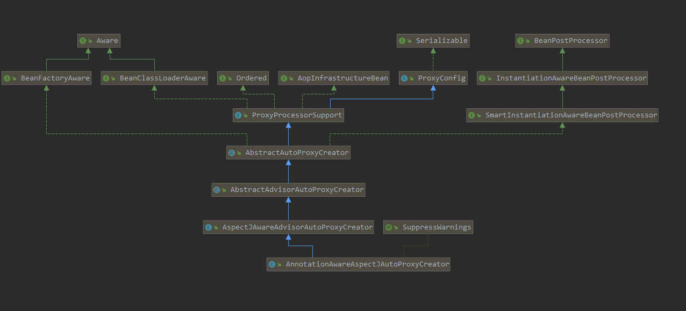
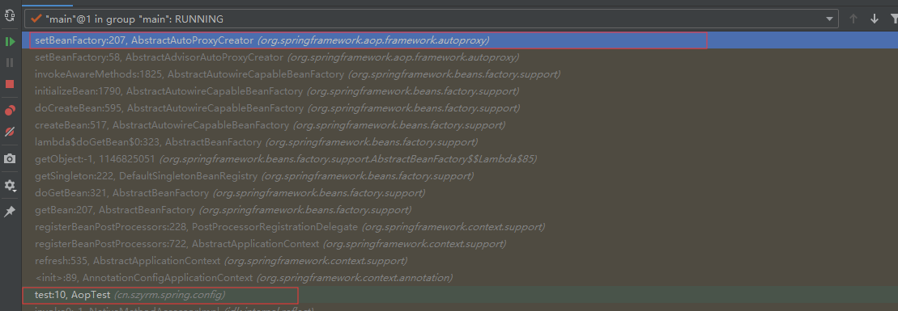
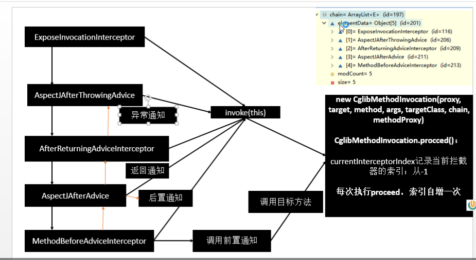

# spring AOP 学习（基于注解）

AOP【面向切面编程】：【底层实现：动态代理】 指在程序运行期间动态的将某段代码切入到指定方法指定位置进行运行的编程方式；

### 一、环境搭建

maven依赖：

```xml
  <dependency>
      <groupId>org.springframework</groupId>
      <artifactId>spring-context</artifactId>
      <version>5.2.1.RELEASE</version>
  </dependency>
  <dependency>
      <groupId>javax.annotation</groupId>
      <artifactId>javax.annotation-api</artifactId>
      <version>1.3.1</version>
  </dependency>
<dependency>
      <groupId>org.springframework</groupId>
      <artifactId>spring-aspects</artifactId>
      <version>5.2.1.RELEASE</version>
  </dependency>
  <dependency>
      <groupId>junit</groupId>
      <artifactId>junit</artifactId>
      <version>4.12</version>
      <scope>test</scope>
  </dependency>
```

### 二、操作步骤

* 将业务逻辑组件添加到容器中

  ```java
  @Component
  public class Car {
      public long driver(long time) throws InterruptedException {
          System.out.println("start driver");
          Thread.sleep(500);
          return  System.currentTimeMillis() - time;
      }
  }
  ```

* 编写切面类并加入到容器中，在切面类上的每一个通知方法上标注通知注解，告诉spring何时何地运行

  ```java
  package cn.szyrm.spring.aop;
  
  import org.aspectj.lang.JoinPoint;
  import org.aspectj.lang.ProceedingJoinPoint;
  import org.aspectj.lang.annotation.*;
  import org.springframework.context.annotation.Configuration;
  import org.springframework.stereotype.Component;
  
  @Component
  @Aspect
  public class LogAspect {
      @Pointcut("execution(public  *  cn.szyrm.spring.aop.Car.driver(long))")
      public  void pointCut(){
  
      }
      @Before(value = "execution(public  *  cn.szyrm.spring.aop.Car.driver(long))")
      public  void logStart(){
          System.out.println("before....");
      }
       @After(value = "pointCut()")
      public  void logEnd(){
           System.out.println("after .... ");
      }
      @AfterReturning(value = "pointCut()")
      public void logReturn(){
          System.out.println("afterReturning .... ");
      }
      @AfterThrowing(value = "pointCut()")
      public void logException(){
  
      }
      @Around(value = "pointCut()")
      public Object logAround(ProceedingJoinPoint joinPoint) throws Throwable {
          System.out.println("around before ...");
          Object proceed = joinPoint.proceed();
          System.out.println(proceed);
          System.out.println("around  after...  ");
          return proceed;
      }
  }
  ```

  

* 开启基于注解的aop模式：`@EnableAspectJAutoProxy` 

```java
@Configuration
@ComponentScan(basePackages = "cn.szyrm.spring.aop")
@EnableAspectJAutoProxy
public class AopConfig {
}
```

* 测试是否正确

  ```java
  public class AopTest {
      @Test
      public void test() throws InterruptedException {
          AnnotationConfigApplicationContext context = new AnnotationConfigApplicationContext(AopConfig.class);
          Car car = context.getBean("car", Car.class);
  
          long driver = car.driver(System.currentTimeMillis());
  
  
      }
  }
  ```

  ```txt
  around before ...
  before....
  start driver
  516
  around  after...  
  after .... 
  afterReturning .... 
  ```

  ### 三、`aop原理` 

  1、`AnnotationAwareAspectJAutoProxyCreator` 的添加过程

   通过`@EnableAspectJAutoProxy` 注解来导入 ` AspectJAutoProxyRegistrar` 组件。

  该组件通过调用`org.springframework.context.annotation.AspectJAutoProxyRegistrar#registerBeanDefinitions ` 方法来注册一个 `AnnotationAwareAspectJAutoProxyCreator` 后置处理器，其在容器的名称为：`org.springframework.aop.config.internalAutoProxyCreator` 

  ```java
  	AopConfigUtils.registerAspectJAnnotationAutoProxyCreatorIfNecessary(registry);
  
  		AnnotationAttributes enableAspectJAutoProxy =
  				AnnotationConfigUtils.attributesFor(importingClassMetadata, EnableAspectJAutoProxy.class);
  		if (enableAspectJAutoProxy != null) {
  			if (enableAspectJAutoProxy.getBoolean("proxyTargetClass")) {
  				AopConfigUtils.forceAutoProxyCreatorToUseClassProxying(registry);
  			}
  			if (enableAspectJAutoProxy.getBoolean("exposeProxy")) {
  				AopConfigUtils.forceAutoProxyCreatorToExposeProxy(registry);
  			}
  		}
  ```

  真正执行注册`AnnotationAwareAspectJAutoProxyCreator` 组件的方法：

```java

	@Nullable
	private static BeanDefinition registerOrEscalateApcAsRequired(
			Class<?> cls, BeanDefinitionRegistry registry, @Nullable Object source) {

		Assert.notNull(registry, "BeanDefinitionRegistry must not be null");

		if (registry.containsBeanDefinition(AUTO_PROXY_CREATOR_BEAN_NAME)) {
			BeanDefinition apcDefinition = registry.getBeanDefinition(AUTO_PROXY_CREATOR_BEAN_NAME);
			if (!cls.getName().equals(apcDefinition.getBeanClassName())) {
				int currentPriority = findPriorityForClass(apcDefinition.getBeanClassName());
				int requiredPriority = findPriorityForClass(cls);
				if (currentPriority < requiredPriority) {
					apcDefinition.setBeanClassName(cls.getName());
				}
			}
			return null;
		}

		RootBeanDefinition beanDefinition = new RootBeanDefinition(cls);
		beanDefinition.setSource(source);
		beanDefinition.getPropertyValues().add("order", Ordered.HIGHEST_PRECEDENCE);
		beanDefinition.setRole(BeanDefinition.ROLE_INFRASTRUCTURE);
		registry.registerBeanDefinition(AUTO_PROXY_CREATOR_BEAN_NAME, beanDefinition);
		return beanDefinition;
	}
```


`AnnotationAwareAspectJAutoProxyCreator` 类的继承结构如下：



  从上面`UML` 图可以看出，其实现了`BenPostProcessor` 接口和`BeanFactoryAwre` 接口。必然会有  ` setBeanFacotry`方法 及与`beanPostProcessor` 接口相关的方法。在这些方法上打上断点然后调试



 整个的流程如下：

* 1)、：传入配置类，创建`IOC` 容器 `new AnnotationConfigApplicationContext(AopConfig.class);`  

* 2)、注册配置类，调用refresh()刷新容器

* 3）、注册bean的后置处理器来拦截bean的创建 ：`registerBeanPostProcessors(beanFactory);` 
  * 1、先获取`IOC` 容器中的所有的`BeanPostProcessor` 的定义的名称

  * 2、给容器中加别BeanPostProcessor

  * 3、优先注册实现了PriorityOrdered接口的BeanPostPrcessor

  * 4、再给容器总注册实现了Order接口的BeanPostProcessor

  * 5、注册没实现order接口的BeanPostProcessor

  * 6、注册`BeanPostProcessor` ，实际上就是创建BeanPostProcessor对象，保存在容器中；

    创建`internalAutoProxyCreator`  的 `BeanPostProcessor  [ `AnnotationAwareAspectJAutoProxyCreator ]

    执行创建bean的方法：`org.springframework.beans.factory.support.AbstractAutowireCapableBeanFactory#doCreateBean`

    ```java
    protected Object doCreateBean(final String beanName, final RootBeanDefinition mbd, final @Nullable Object[] args)
    			throws BeanCreationException {
    
    		// Instantiate the bean.
    		BeanWrapper instanceWrapper = null;
    		if (mbd.isSingleton()) {
    			instanceWrapper = this.factoryBeanInstanceCache.remove(beanName);
    		}
    		if (instanceWrapper == null) {
    			instanceWrapper = createBeanInstance(beanName, mbd, args);
    		}
    		final Object bean = instanceWrapper.getWrappedInstance();
    		Class<?> beanType = instanceWrapper.getWrappedClass();
    		if (beanType != NullBean.class) {
    			mbd.resolvedTargetType = beanType;
    		}
    
    		// Allow post-processors to modify the merged bean definition.
    		synchronized (mbd.postProcessingLock) {
    			if (!mbd.postProcessed) {
    				try {
    					applyMergedBeanDefinitionPostProcessors(mbd, beanType, beanName);
    				}
    				catch (Throwable ex) {
    					throw new BeanCreationException(mbd.getResourceDescription(), beanName,
    							"Post-processing of merged bean definition failed", ex);
    				}
    				mbd.postProcessed = true;
    			}
    		}
    
    		// Eagerly cache singletons to be able to resolve circular references
    		// even when triggered by lifecycle interfaces like BeanFactoryAware.
    		boolean earlySingletonExposure = (mbd.isSingleton() && this.allowCircularReferences &&
    				isSingletonCurrentlyInCreation(beanName));
    		if (earlySingletonExposure) {
    			if (logger.isTraceEnabled()) {
    				logger.trace("Eagerly caching bean '" + beanName +
    						"' to allow for resolving potential circular references");
    			}
    			addSingletonFactory(beanName, () -> getEarlyBeanReference(beanName, mbd, bean));
    		}
    
    		// Initialize the bean instance.
    		Object exposedObject = bean;
    		try {
    			populateBean(beanName, mbd, instanceWrapper);
    			exposedObject = initializeBean(beanName, exposedObject, mbd);
    		}
    		catch (Throwable ex) {
    			if (ex instanceof BeanCreationException && beanName.equals(((BeanCreationException) ex).getBeanName())) {
    				throw (BeanCreationException) ex;
    			}
    			else {
    				throw new BeanCreationException(
    						mbd.getResourceDescription(), beanName, "Initialization of bean failed", ex);
    			}
    		}
    
    		if (earlySingletonExposure) {
    			Object earlySingletonReference = getSingleton(beanName, false);
    			if (earlySingletonReference != null) {
    				if (exposedObject == bean) {
    					exposedObject = earlySingletonReference;
    				}
    				else if (!this.allowRawInjectionDespiteWrapping && hasDependentBean(beanName)) {
    					String[] dependentBeans = getDependentBeans(beanName);
    					Set<String> actualDependentBeans = new LinkedHashSet<>(dependentBeans.length);
    					for (String dependentBean : dependentBeans) {
    						if (!removeSingletonIfCreatedForTypeCheckOnly(dependentBean)) {
    							actualDependentBeans.add(dependentBean);
    						}
    					}
    					if (!actualDependentBeans.isEmpty()) {
    						throw new BeanCurrentlyInCreationException(beanName,
    								"Bean with name '" + beanName + "' has been injected into other beans [" +
    								StringUtils.collectionToCommaDelimitedString(actualDependentBeans) +
    								"] in its raw version as part of a circular reference, but has eventually been " +
    								"wrapped. This means that said other beans do not use the final version of the " +
    								"bean. This is often the result of over-eager type matching - consider using " +
    								"'getBeanNamesOfType' with the 'allowEagerInit' flag turned off, for example.");
    					}
    				}
    			}
    		}
    
    		// Register bean as disposable.
    		try {
    			registerDisposableBeanIfNecessary(beanName, bean, mbd);
    		}
    		catch (BeanDefinitionValidationException ex) {
    			throw new BeanCreationException(
    					mbd.getResourceDescription(), beanName, "Invalid destruction signature", ex);
    		}
    
    		return exposedObject;
    	}
    
    ```

    * 1）、先创建Bean的实例

      ```java
      instanceWrapper = createBeanInstance(beanName, mbd, args);
      ```

    * 2）、给bean的属性赋值

      ```java
      populateBean(beanName, mbd, instanceWrapper);
      ```

    * 3）、初始化bean：BeanPostProcess就是在此进行工作的

      ```java
      exposedObject = initializeBean(beanName, exposedObject, mbd)
      ```

      方法源码如下：

      ```java
      protected Object initializeBean(final String beanName, final Object bean, @Nullable RootBeanDefinition mbd) {
      		if (System.getSecurityManager() != null) {
      			AccessController.doPrivileged((PrivilegedAction<Object>) () -> {
      				invokeAwareMethods(beanName, bean);
      				return null;
      			}, getAccessControlContext());
      		}
      		else {
                  //1、检查bean是否实现了各种awre接口
      			invokeAwareMethods(beanName, bean);
      		}
      
      		Object wrappedBean = bean;
      		if (mbd == null || !mbd.isSynthetic()) {
                  //2、beanPostProcessor 的前置处理方法
      			wrappedBean = applyBeanPostProcessorsBeforeInitialization(wrappedBean, beanName);
      		}
      
      		try {
                  //3、bean自定义初始化方法调用
      			invokeInitMethods(beanName, wrappedBean, mbd);
      		}
      		catch (Throwable ex) {
      			throw new BeanCreationException(
      					(mbd != null ? mbd.getResourceDescription() : null),
      					beanName, "Invocation of init method failed", ex);
      		}
      		if (mbd == null || !mbd.isSynthetic()) {
                  //4、 beanProcessor的后置处理方法
      			wrappedBean = applyBeanPostProcessorsAfterInitialization(wrappedBean, beanName);
      		}
      
      		return wrappedBean;
      	}
      ```

      

      * 1、检查bean是否实现了各种`awre` 接口
      * 2、`beanPostProcessor ` 的前置处理方法
      *  3、bean自定义初始化方法调用
      * 4、 `beanProcessor` 的后置处理方法

  * 7、将`beanPostPorcessor` 添加到容器中：调用方法

    `beanFactory.addBeanPostProcessor(postProcessor);`

2、完成剩余的单实例bean的创建：`finishBeanFactoryInitialization(beanFactory);`   ====aop代理对象创建等

* 遍历容器中所有bean的名称，并进行依次创建

  getBean ()--> doGetBean() -->getSingleton() -->

* 创建bean

  * 1、先从缓存中获取bean，如果能够获取到，说明bean在之前已经被创建过，直接使用，否则再创建。

  * 2、`createBean();` 创建bean

    * ` resolveBeforeInstantiation(beanName, mbdToUse);` :后置处理器尝试返回代理对象

      希望后置处理器能够返回一个对象，如果能返回代理对象就使用，如果不能则继续创建

      * 创建的源码

        ```java
        bean = applyBeanPostProcessorsBeforeInstantiation(targetType, beanName);
        if (bean != null) {
           bean = applyBeanPostProcessorsAfterInitialization(bean, beanName);
        }
        ```

        ```java
        @Override
        	public Object applyBeanPostProcessorsBeforeInitialization(Object existingBean, String beanName)
        			throws BeansException {
        
        		Object result = existingBean;
        		for (BeanPostProcessor processor : getBeanPostProcessors()) {
        			Object current = processor.postProcessBeforeInitialization(result, beanName);
        			if (current == null) {
        				return result;
        			}
        			result = current;
        		}
        		return result;
        	}
        
        	@Override
        	public Object applyBeanPostProcessorsAfterInitialization(Object existingBean, String beanName)
        			throws BeansException {
        
        		Object result = existingBean;
        		for (BeanPostProcessor processor : getBeanPostProcessors()) {
        			Object current = processor.postProcessAfterInitialization(result, beanName);
        			if (current == null) {
        				return result;
        			}
        			result = current;
        		}
        		return result;
        	}
        ```

        

    * `doCreateBean(beanName, mbdToUse, args);` //真正的去创建bean的实例

  `AnnotationAwareAspectJAutoProxyCreator` 在所有的bean创建前会尝试返回bean的实例

  【BeanPostProcessor是在Bean对象创建完成初始化前后调用的】

  【`InstantiationAwareBeanPostProcessor` 是在创建Bean实例之前先尝试用后置处理器返回对象的】

  `AnnotationAwareAspectJAutoProxyCreator`  【`InstatiationBeanPostProcessor` 】的作用

  1)、每一个bean创建之前，调用postProcessorBeforeInstatiation():

  * 1、判断当前bean是否在`advisedBeans` 中（保存了所有需要增强的bean）

  * 2、判断当前bean是否是基础类型的Advice、Pointcut、Advisor、AopInfrastructureBean，

    或者是否是切面（@Aspect）

  * 3、是否需要跳过

    * 获取候选的增强器（切面里面的通知方法）【List<Advisor> candidateAdvisors】

      每一个封装的通知方法的增强器是 InstantiationModelAwarePointcutAdvisor；

      判断每一个增强器是否是 AspectJPointcutAdvisor 类型的；返回true

    * 2）、永远返回false

  创建对象

  postProcessAfterInitialization；

  

```
protected Object wrapIfNecessary(Object bean, String beanName, Object cacheKey) {
   if (StringUtils.hasLength(beanName) && this.targetSourcedBeans.contains(beanName)) {
      return bean;
   }
   if (Boolean.FALSE.equals(this.advisedBeans.get(cacheKey))) {
      return bean;
   }
   if (isInfrastructureClass(bean.getClass()) || shouldSkip(bean.getClass(), beanName)) {
      this.advisedBeans.put(cacheKey, Boolean.FALSE);
      return bean;
   }

   // Create proxy if we have advice.
   Object[] specificInterceptors = getAdvicesAndAdvisorsForBean(bean.getClass(), beanName, null);
   if (specificInterceptors != DO_NOT_PROXY) {
      this.advisedBeans.put(cacheKey, Boolean.TRUE);
      Object proxy = createProxy(
            bean.getClass(), beanName, specificInterceptors, new SingletonTargetSource(bean));
      this.proxyTypes.put(cacheKey, proxy.getClass());
      return proxy;
   }

   this.advisedBeans.put(cacheKey, Boolean.FALSE);
   return bean;
}
```

* 获取当前bean的所有的增强器
* 在`  advisedBeans`添加当前bean ,//标识当前bean已经被增强处理
* 使用` createProxy`   方法来创建代理对象

通过`org.springframework.aop.framework.autoproxy.AbstractAutoProxyCreator#createProxy` 来真正执行aop代理对象的创建

决定是创建JDK动态代理还是CGlib代理的源码如下：

```java
//org.springframework.aop.framework.DefaultAopProxyFactory#createAopProxy
	@Override
	public AopProxy createAopProxy(AdvisedSupport config) throws AopConfigException {
		if (config.isOptimize() || config.isProxyTargetClass() || hasNoUserSuppliedProxyInterfaces(config)) {
			Class<?> targetClass = config.getTargetClass();
			if (targetClass == null) {
				throw new AopConfigException("TargetSource cannot determine target class: " +
						"Either an interface or a target is required for proxy creation.");
			}
			if (targetClass.isInterface() || Proxy.isProxyClass(targetClass)) {
				return new JdkDynamicAopProxy(config);
			}
			return new ObjenesisCglibAopProxy(config);
		}
		else {
			return new JdkDynamicAopProxy(config);
		}
	}
```

可以看出，如看被代理的类如果有接口；则会创建JDK的动态代理。否则就使用CGlib来创建代理对象。

3、AOP代理对象的目标方法执行

会调用下面的方法

`org.springframework.aop.framework.CglibAopProxy.DynamicAdvisedInterceptor#intercept`

* 1、根据ProxyFactory对象获取将要执行的目标方法拦截器链

```
List<Object> chain = this.advised.getInterceptorsAndDynamicInterceptionAdvice(method, targetClass);
//获取拦截链的核心方法
@Override
	public List<Object> getInterceptorsAndDynamicInterceptionAdvice(
			Advised config, Method method, @Nullable Class<?> targetClass) {

		// This is somewhat tricky... We have to process introductions first,
		// but we need to preserve order in the ultimate list.
		AdvisorAdapterRegistry registry = GlobalAdvisorAdapterRegistry.getInstance();
		Advisor[] advisors = config.getAdvisors();
		List<Object> interceptorList = new ArrayList<>(advisors.length);
		Class<?> actualClass = (targetClass != null ? targetClass : method.getDeclaringClass());
		Boolean hasIntroductions = null;

		for (Advisor advisor : advisors) {
			if (advisor instanceof PointcutAdvisor) {
				// Add it conditionally.
				PointcutAdvisor pointcutAdvisor = (PointcutAdvisor) advisor;
				if (config.isPreFiltered() || pointcutAdvisor.getPointcut().getClassFilter().matches(actualClass)) {
					MethodMatcher mm = pointcutAdvisor.getPointcut().getMethodMatcher();
					boolean match;
					if (mm instanceof IntroductionAwareMethodMatcher) {
						if (hasIntroductions == null) {
							hasIntroductions = hasMatchingIntroductions(advisors, actualClass);
						}
						match = ((IntroductionAwareMethodMatcher) mm).matches(method, actualClass, hasIntroductions);
					}
					else {
						match = mm.matches(method, actualClass);
					}
					if (match) {
						MethodInterceptor[] interceptors = registry.getInterceptors(advisor);
						if (mm.isRuntime()) {
							// Creating a new object instance in the getInterceptors() method
							// isn't a problem as we normally cache created chains.
							for (MethodInterceptor interceptor : interceptors) {
								interceptorList.add(new InterceptorAndDynamicMethodMatcher(interceptor, mm));
							}
						}
						else {
							interceptorList.addAll(Arrays.asList(interceptors));
						}
					}
				}
			}
			else if (advisor instanceof IntroductionAdvisor) {
				IntroductionAdvisor ia = (IntroductionAdvisor) advisor;
				if (config.isPreFiltered() || ia.getClassFilter().matches(actualClass)) {
					Interceptor[] interceptors = registry.getInterceptors(advisor);
					interceptorList.addAll(Arrays.asList(interceptors));
				}
			}
			else {
				Interceptor[] interceptors = registry.getInterceptors(advisor);
				interceptorList.addAll(Arrays.asList(interceptors));
			}
		}

		return interceptorList;
	}
```

遍历所有的增强器，将所有的增强器转换为:`Interceptor` 

```java
registry.getInterceptors(advisor);
```


* 2、如果没有拦截器链，直接执行目标方法

* 3、如果有拦截器链，把需要执行目标对象、目标方法、拦截链等信息创建`CglibMethodInvocation` 对象并调用proceed()方法。

  ```java
  retVal = new CglibMethodInvocation(proxy, target, method, args, targetClass, chain, methodProxy).proceed();
  ```

  * 拦截器链的调用




* 4、处理返回值

  ```java 
  retVal = processReturnType(proxy, target, method, retVal);
  ```

  

```java
CREATE TABLE student(
  id INT PRIMARY KEY AUTO_INCREMENT COMMENT '学号',
  name VARCHAR(200) COMMENT '姓名',
  age    int COMMENT '年龄'
) COMMENT='学生信息'
```

