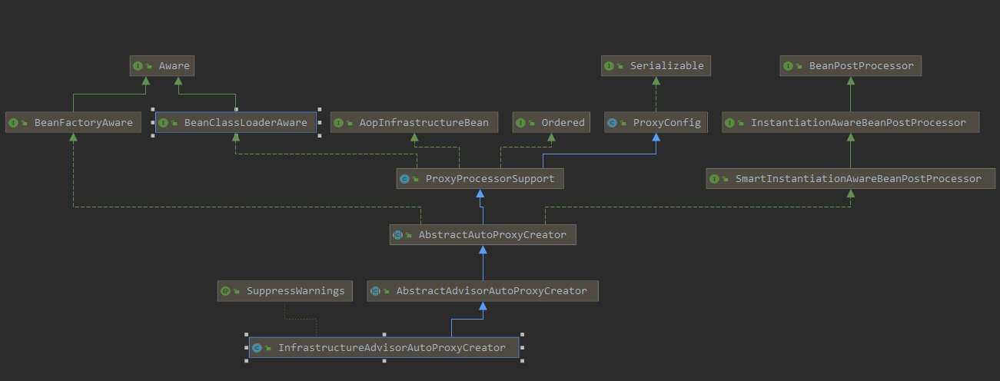

# spring 事务

### spring 声明式事务环境搭建

1、导入相关的依赖：

```xml
   <dependency>
            <groupId>c3p0</groupId>
            <artifactId>c3p0</artifactId>
            <version>0.9.1.2</version>
        </dependency>

      <dependency>
        <groupId>org.springframework</groupId>
        <artifactId>spring-aspects</artifactId>
        <version>5.2.1.RELEASE</version>
    </dependency>
        <dependency>
            <groupId>org.springframework</groupId>
            <artifactId>spring-jdbc</artifactId>
            <version>5.2.1.RELEASE</version>
        </dependency>
```

2、配置数据源、jdbcTemplate操作数据

```java
    @Bean
    public DataSource dataSource() throws PropertyVetoException {
        ComboPooledDataSource dataSource = new ComboPooledDataSource();
        dataSource.setUser("root");
        dataSource.setPassword("1234");
        dataSource.setDriverClass("com.mysql.cj.jdbc.Driver");
        dataSource.setJdbcUrl("jdbc:mysql://localhost:3306/test?serverTimezone=UTC");
        return dataSource;
    }

    @Bean
    public JdbcTemplate jdbcTemplate () throws PropertyVetoException {
        //spring 对@configuration类会进行处理
      return   new JdbcTemplate(dataSource());
    }
```


3、给方法添加@Transactional注解

```java
  @Transactional
    public void insert(){
        userDao.insert();
        System.out.println("插入数据成功");
        int i = 1/0;
    }
```

4、使用@EnableTransactionManagement来开启事务

```java
@Configuration
@ComponentScan
@EnableTransactionManagement
public class TxConfig {}
```


5、配置事务管理器

```java
 //注册事务管理器
    @Bean
    public PlatformTransactionManager transactionManager() throws PropertyVetoException {
        return new DataSourceTransactionManager(dataSource());
    }
```

### AOP原理解读 :@EnableTransactionManagement注解添加的组件

​	1)、@EnableTransactionManagement

​	通过@Import导入  `TransactionManagementConfigurationSelector` ,而`TransactionManagementConfigurationSelector` 会通过`org.springframework.transaction.annotation.TransactionManagementConfigurationSelector#selectImports` 方法导入：

* `AutoProxyRegistrar `

  给容器注入：`InfrastructureAdvisorAutoProxyCreator` 

  `InfrastructureAdvisorAutoProxyCreator`  的作用：其跟AOP的底层实现功能一致

  

* `ProxyTransactionManagementConfiguration` 

