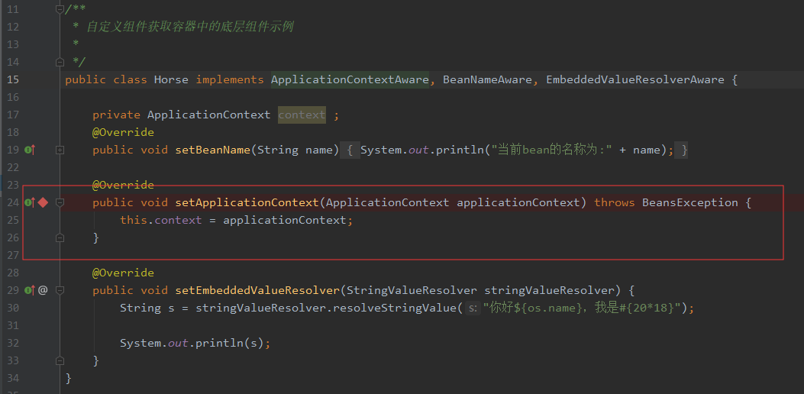
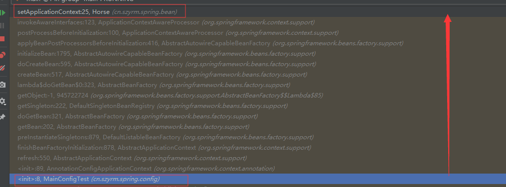

### spring 自动装配

spring 利用依赖注入，完成对IOC容器中各个组件的依赖关系赋值：

* 1)、@Autowired:自动注入

* 2）、Spring还支持使用@Resource(JSR250)和@Inject(JSR330)[java规范的注解]

  * @Resource:

    可以和@Autowired一样实现自动装配功能；默认是按照组件名称进行装配的；

    没有能支持@Primary功能没有支持@Autowired（reqiured=false）;

  * @Inject:

    需要导入javax.inject的包，和Autowired的功能一样。没有required=false的功能；

  @Autowired:Spring定义的； @Resource、@Inject都是java规范

`AutowiredAnnotationBeanPostProcessor` :j解析完成自动装配的功能

* 3）@Autowired:构造器，参数方法、属性：都是从容器中获取参数的值
  * 1、【标注在参数上】：@Bean + 方法参数：参数从容器中获取；@Autowired可以省略不写
  * 2、【标注在构造器上】：如果组件只有一个有参构造器，这个有参构造器的@Autowired可以省略，参数位置的组件还是可以自动从容器获取
  * 3、放在参数位置

 * 4）、自定义组件想要使用Spring容器底层的一些组件（ApplicationContext，BeanFactory，xxx）；

   自定义组件实现xxxAware；在创建对象的时候，会调用接口规定的方法注入相关组件；Aware；

   把Spring底层一些组件注入到自定义的Bean中；

   xxxAware：功能使用xxxProcessor；

   ApplicationContextAware==》ApplicationContextAwareProcessor；

   ```java
   /**
    * 自定义组件获取容器中的底层组件示例
    *
    */
   public class Horse implements ApplicationContextAware, BeanNameAware, EmbeddedValueResolverAware {
   
       private ApplicationContext context ;
       @Override
       public void setBeanName(String name) {
           System.out.println("当前bean的名称为:" + name);
       }
   
       @Override
       public void setApplicationContext(ApplicationContext applicationContext) throws BeansException {
           this.context = applicationContext;
       }
   
       @Override
       public void setEmbeddedValueResolver(StringValueResolver stringValueResolver) {
           String s = stringValueResolver.resolveStringValue("你好${os.name}，我是#{20*18}");
   
           System.out.println(s);
       }
   }
   
   ```

   

二、`ApplicationContextAware`   实现自动注入 `ApplicationContext` 源码分析

* 1、在setApplicationContext（）方法上添加断点

  

* 2、以debugger方式运行，获取到整个方法的调用栈

  

* 3、源码分析

  spring在容器启动的时候会先向容器中注册所有的BeanProcessor,然后才对剩余的单实例的bean进行创建。源码如下：

  ```java
   public void refresh() throws BeansException, IllegalStateException {
          synchronized(this.startupShutdownMonitor) {
              this.prepareRefresh();
              ConfigurableListableBeanFactory beanFactory = this.obtainFreshBeanFactory();
              this.prepareBeanFactory(beanFactory);
  
              try {
                  this.postProcessBeanFactory(beanFactory);
                  this.invokeBeanFactoryPostProcessors(beanFactory);
                  //向容器中注册BeanPostProcessors
                  this.registerBeanPostProcessors(beanFactory);
                  this.initMessageSource();
                  this.initApplicationEventMulticaster();
                  this.onRefresh();
                  this.registerListeners();
                  //初始化其他的单实例bean
                  this.finishBeanFactoryInitialization(beanFactory);
                  this.finishRefresh();
              } catch (BeansException var9) {
                  if (this.logger.isWarnEnabled()) {
                      this.logger.warn("Exception encountered during context initialization - cancelling refresh attempt: " + var9);
                  }
  
                  this.destroyBeans();
                  this.cancelRefresh(var9);
                  throw var9;
              } finally {
                  this.resetCommonCaches();
              }
  
          }
      }
  ```

  

  当创建`Horse` 这个bean的实例的实例的时候，会调用 `org.springframework.context.support.ApplicationContextAwareProcessor#postProcessBeforeInitialization()` 方法来对bean进行初始化时的前置工作。该方法实际上会调用如下的一个核心方法：

  ```java
   private void invokeAwareInterfaces(Object bean) {
          if (bean instanceof EnvironmentAware) {
              ((EnvironmentAware)bean).setEnvironment(this.applicationContext.getEnvironment());
          }
  
          if (bean instanceof EmbeddedValueResolverAware) {
              ((EmbeddedValueResolverAware)bean).setEmbeddedValueResolver(this.embeddedValueResolver);
          }
  
          if (bean instanceof ResourceLoaderAware) {
              ((ResourceLoaderAware)bean).setResourceLoader(this.applicationContext);
          }
  
          if (bean instanceof ApplicationEventPublisherAware) {
              ((ApplicationEventPublisherAware)bean).setApplicationEventPublisher(this.applicationContext);
          }
  
          if (bean instanceof MessageSourceAware) {
              ((MessageSourceAware)bean).setMessageSource(this.applicationContext);
          }
  
          if (bean instanceof ApplicationContextAware) {
              ((ApplicationContextAware)bean).setApplicationContext(this.applicationContext);
          }
  
      }
  ```

  从以上源码可以看出，当一个bean实现了`EnvironmentAware` 、 `EmbeddedValueResolverAware` 、

`ResourceLoaderAware ` 、`ApplicationEventPublisherAware` 、`MessageSourceAware`、`ApplicationContextAware` 接口的任何一个或多个的时候，`ApplicationContextAwareProcessor` 都会调用其实现方法来进行相应的处理。

实例中的`cn.szyrm.spring.bean.Horse` 实现了`ApplicationContextAware` 接口，所以spring在创建该bean的时候，会使用`ApplicationContextAwareProcessor`   来调用` Horse`  类中的`setApplicationContext` 来进行相应处理。

  