# spring boot 与缓存

### 一、JSR107 

java Caching定义了5个核心接口，分别是CachingProvider，CacheManager,Cache,Entry,Expiry

* CachingProvider定义了创建、配置、获取、管理和控制多个CacheManager。一个应用可以在运行期访问多个CachingProvider.
* CacheManager定义了创建、配置、获取、管理和控制多个唯一命名cache。这些Cache存放在CacheManager的上下文中。一个CacheManager仅被一个CachingProvider所拥有。
* Cache是一个类似Map的数据 结构并临时存储以key为索引的值。一个Cache仅被一个CacheManager所拥有。
* Entry是一个存储在Cache中的key-value对。
* Expire每一个存储在Cache中条目有一个定义的有效期。一旦超过这个时间，条目为过期状态。一旦过期，条目将不可以访问、更新和删除。缓存有效期可以通过ExpirePolicy设置。
* 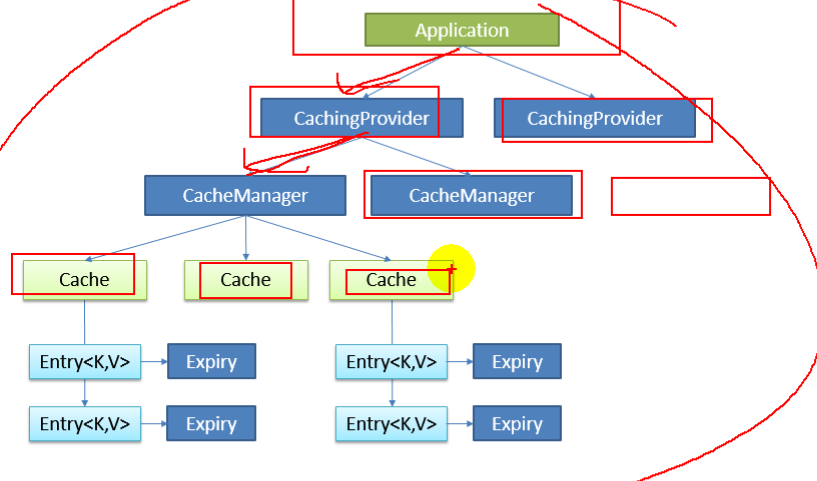

### 二、spring 缓存抽象 

spring从3.1开始定义了`org.springframework.cache.Cache`和`org.springframework.cache.CacheManager`

接口来统一不同的缓存技术。并支持使用JCache(JSR-107)注解简化开发：

* Cache接口为缓存的组件规范定义，包含缓存的各种操作集合
* Cache接口下Spring提供了各种XXXCache的实现；如RedisCache，EhCacheCache,ConcurrentMapCache等
* 每次调用需要缓存功能的方法时，spring会检查指定参数的指定的目标方法是否已经被调用过；如果有就直接从缓存中获取方法调用的结果，瑞国没有就调用方法并缓存结果返回给用户。下次调用直接从缓存中获取。
* 使用spring缓存抽象时我们需要关注以下两点：
* 1、确定方法需要被缓存以及他们的缓存策略
* 2、从缓存中读取之前缓存存储的数据

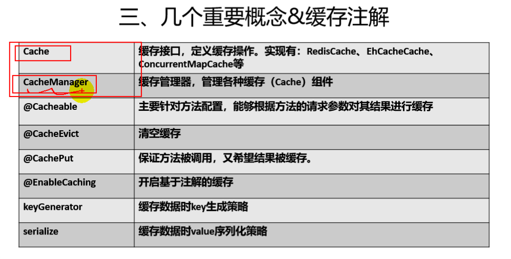

### 三、springboot 整合mybatis的环境搭建

maven依赖：

```xml
<?xml version="1.0" encoding="UTF-8"?>
<project xmlns="http://maven.apache.org/POM/4.0.0" xmlns:xsi="http://www.w3.org/2001/XMLSchema-instance"
         xsi:schemaLocation="http://maven.apache.org/POM/4.0.0 https://maven.apache.org/xsd/maven-4.0.0.xsd">
    <modelVersion>4.0.0</modelVersion>
    <parent>
        <groupId>org.springframework.boot</groupId>
        <artifactId>spring-boot-starter-parent</artifactId>
        <version>2.2.1.RELEASE</version>
        <relativePath/> <!-- lookup parent from repository -->
    </parent>
    <groupId>cn.szyrm</groupId>
    <artifactId>spring_boot</artifactId>
    <version>0.0.1-SNAPSHOT</version>
    <name>spring_boot</name>
    <description>Demo project for Spring Boot</description>

    <properties>
        <java.version>13</java.version>
        <maven.compiler.source>13</maven.compiler.source>
        <maven.compiler.target>13</maven.compiler.target>
        <maven.compiler.compilerVersion>13</maven.compiler.compilerVersion>
    </properties>

    <dependencies>
        <dependency>
            <groupId>org.springframework.boot</groupId>
            <artifactId>spring-boot-starter-web</artifactId>
        </dependency>
        <dependency>
            <groupId>org.springframework.boot</groupId>
            <artifactId>spring-boot-starter-cache</artifactId>
        </dependency>
        <dependency>
            <groupId>org.mybatis.spring.boot</groupId>
            <artifactId>mybatis-spring-boot-starter</artifactId>
            <version>2.1.1</version>
        </dependency>
        <dependency>
            <groupId>mysql</groupId>
            <artifactId>mysql-connector-java</artifactId>
            <scope>runtime</scope>
        </dependency>

        <dependency>
            <groupId>org.springframework.boot</groupId>
            <artifactId>spring-boot-starter-test</artifactId>
            <scope>test</scope>
            <exclusions>
                <exclusion>
                    <groupId>org.junit.vintage</groupId>
                    <artifactId>junit-vintage-engine</artifactId>
                </exclusion>
            </exclusions>
        </dependency>
    </dependencies>

    <build>
        <plugins>
            <plugin>
                <groupId>org.springframework.boot</groupId>
                <artifactId>spring-boot-maven-plugin</artifactId>
            </plugin>
        </plugins>
    </build>

</project>

```


配置文件：

```properties

spring.datasource.url=jdbc:mysql://localhost:3306/spring_cache?serverTimezone=UTC
spring.datasource.username=root
spring.datasource.password=1234
spring.datasource.driver-class-name=com.mysql.cj.jdbc.Driver
mybatis.mapperLocations =classpath:mapper/*.xml
#开启驼峰命名
mybatis.configuration.map-underscore-to-camel-case=true
```

Mapper.xml文件

```xml
<!DOCTYPE mapper
        PUBLIC "-//mybatis.org//DTD Mapper 3.0//EN"
        "http://mybatis.org/dtd/mybatis-3-mapper.dtd">

<mapper namespace="cn.szyrm.cache.mapper.EmployeeMapper">
    <insert id="insert">
       INSERT INTO employee(lastName,email,gender,d_id) VALUES(#{lastName},#{email},#{gender},#{dId})
    </insert>
    <select id="getEmpByLastName" resultType="cn.szyrm.cache.bean.Employee">
        SELECT * FROM employee WHERE lastName = #{lastName}
    </select>
    <select id="getEmpById" resultType="cn.szyrm.cache.bean.Employee">
        SELECT * FROM employee WHERE id = #{id}
    </select>
    <update id="updateEmp" >
        UPDATE employee SET lastName=#{lastName},email=#{email},gender=#{gender},d_id=#{dId} WHERE id=#{id}
    </update>
    <delete id="deleteEmpById">
        DELETE FROM employee WHERE id=#{id}
    </delete>
</mapper>
```

Mapper接口

```java

import cn.szyrm.cache.bean.Employee;
import org.apache.ibatis.annotations.*;

@Mapper
public interface EmployeeMapper {

   // @Select("SELECT * FROM employee WHERE id = #{id}")
    public Employee getEmpById(Integer id);

  //  @Update("UPDATE employee SET lastName=#{lastName},email=#{email},gender=#{gender},d_id=#{dId} WHERE id=#{id}")
    public void updateEmp(Employee employee);

  //  @Delete("DELETE FROM employee WHERE id=#{id}")
    public void deleteEmpById(Integer id);

 //   @Insert("INSERT INTO employee(lastName,email,gender,d_id) VALUES(#{lastName},#{email},#{gender},#{dId})")
    public void insertEmployee(Employee employee);

  //  @Select("SELECT * FROM employee WHERE lastName = #{lastName}")
    Employee getEmpByLastName(String lastName);
}

```

配置类扫描指定的包名：

```java
@SpringBootApplication
@MapperScan("cn.szyrm.cache.mapper")
public class Application {

    public static void main(String[] args) {
        SpringApplication.run(Application.class, args);
    }

}
```

测试搭建的环境

```java
@SpringBootTest
class ApplicationTests {
    @Resource
    private EmployeeMapper employeeMapper;

    @Test
    void contextLoads() {
    }
    @Test
    void getEmpById(){
        Employee empById = employeeMapper.getEmpById(1);

        assert empById != null;
    }

}
```

运行`getEmpById` 方法，发下能够正确运行。

### 四、spring 缓存的快速体验

        几个属性：
         cacheNames/value：指定缓存组件的名字;将方法的返回结果放在哪个缓存中，是数组的方式，可以指定多个缓存；
     
          key：缓存数据使用的key；可以用它来指定。默认是使用方法参数的值  1-方法的返回值
                  编写SpEL； #i d;参数id的值   #a0  #p0  #root.args[0]
                   getEmp[2]
     
          keyGenerator：key的生成器；可以自己指定key的生成器的组件id
                  key/keyGenerator：二选一使用;
    
     
           cacheManager：指定缓存管理器；或者cacheResolver指定获取解析器
     
           condition：指定符合条件的情况下才缓存；
                   ,condition = "#id>0"
               condition = "#a0>1"：第一个参数的值》1的时候才进行缓存
     
           unless:否定缓存；当unless指定的条件为true，方法的返回值就不会被缓存；可以获取到结果进行判断
                  unless = "#result == null"
                   unless = "#a0==2":如果第一个参数的值是2，结果不缓存；
           sync：是否使用异步模式
key的表达式;

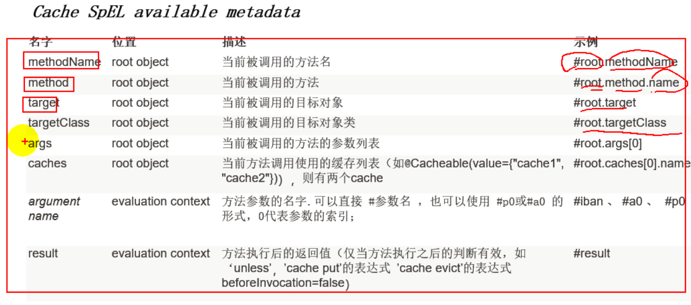

```java
@SpringBootApplication
@MapperScan("cn.szyrm.cache.mapper")
@EnableCaching
public class Application {

    public static void main(String[] args) {
        SpringApplication.run(Application.class, args);
    }

}
```

```java
   @Cacheable(cacheNames="emp")
    public Employee getEmpById(Integer id) {
        return employeeMapper.getEmpById(id);
    }
```

### 五、spring cache原理

* 自动配置类：`CacheAutoConfiguration` 


可能会用到的生效的缓存配置类。

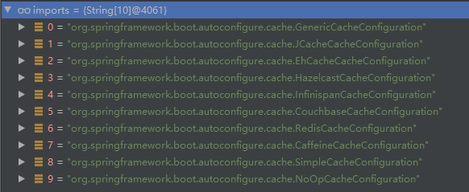

查看哪个自动配置类会生效，在applic.properties文件中添加debug = true。

启动项目后在，控制台搜索`CacheConfiguration`,发现`SimpleCacheConfiguration` 匹配上了。

```txt
 SimpleCacheConfiguration matched:
      - Cache org.springframework.boot.autoconfigure.cache.SimpleCacheConfiguration automatic cache type (CacheCondition)
      - @ConditionalOnBean (types: org.springframework.cache.CacheManager; SearchStrategy: all) did not find any beans (OnBeanCondition)

```

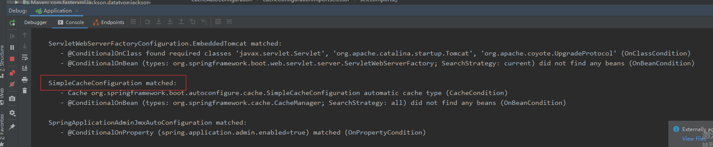

该配置类会闯创建一个`ConcurrentCacheManager` 缓存管理器：将数据缓存在ConcurrentMap中。

运行流程：

​	添加@CacheAble注解的时候：如果通过key能够查询到缓存的值，那么就不会去执行方法体中的内容。

在下列类的方法中添加断点，跟踪代码执行流程。

1、调用的方法出添加断点

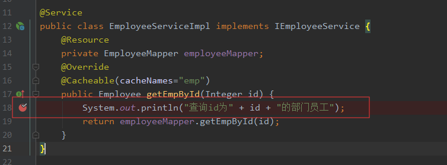

2、`CacheManager` 处添加断点

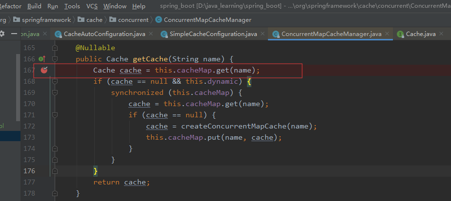

3、`Cache`处添加断点

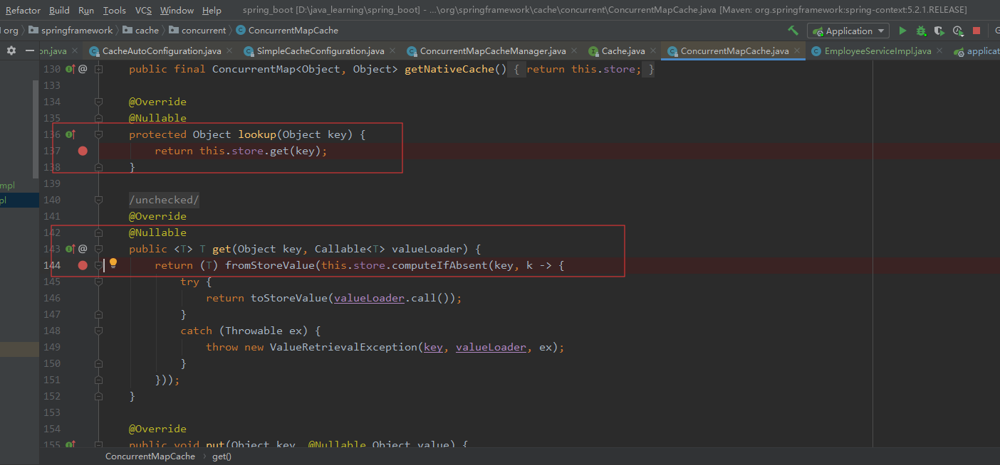


调用getEmpById(id)方法，

1、首先会先进入调用`org.springframework.cache.concurrent.ConcurrentMapCacheManager#getCache` 方法来根据指定的`cacheName` 来获取一个Cache。

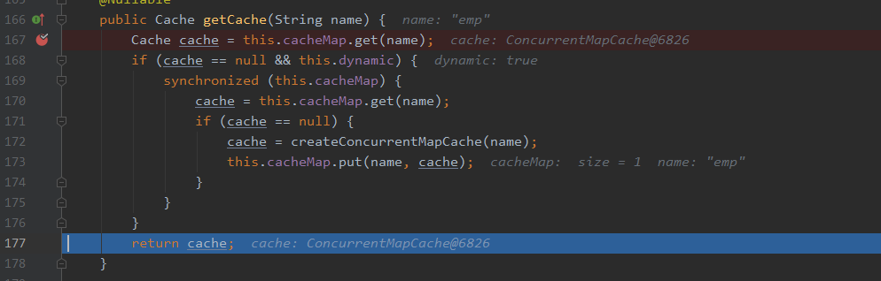

2、根据中获取到Cache和配置的key来获取到缓存的值

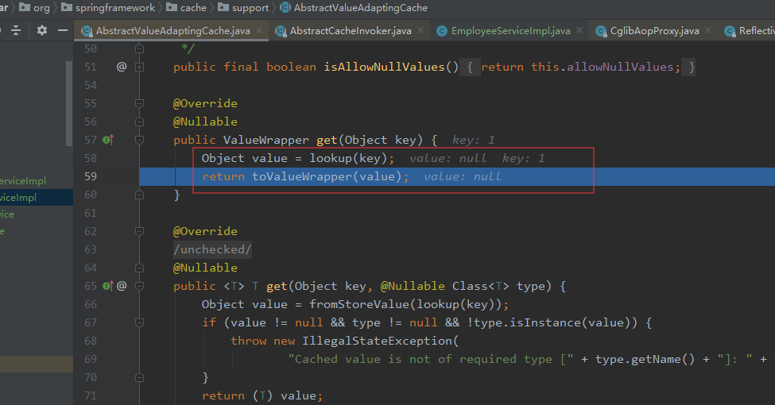

从上述调试截图可以看出，由于是第一次调用，所以没有该值还未进行缓存故获取到值为null。继续跟踪代码，下面截图的代码逻辑为：首先从缓存中获取到，如果没有获取到，那么就真正调用方法。

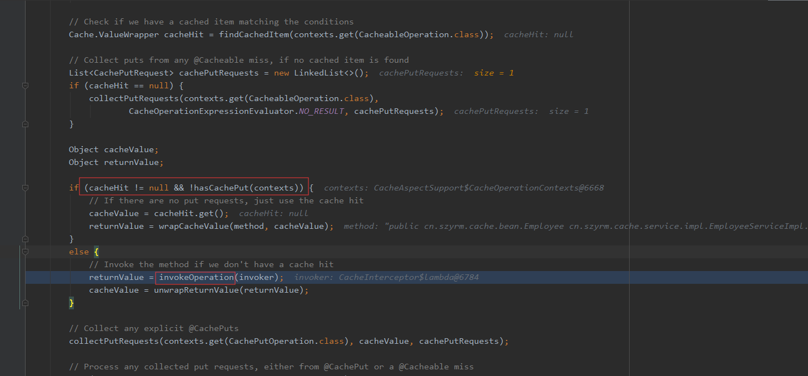

获取方法的返回值后，随后会调用cache的put方法来存储结果。

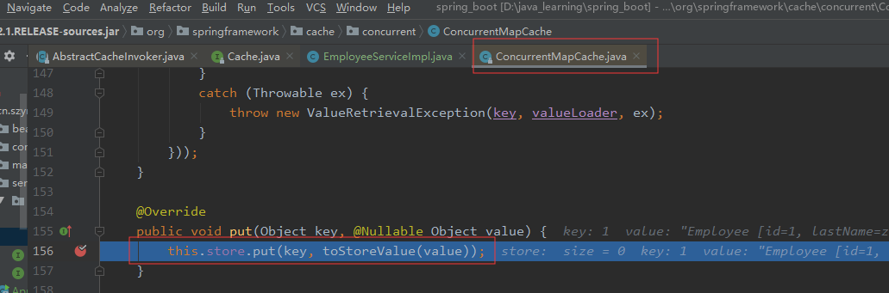

* 2、@CachePut:每次都执行方法体，然后将方法执行的结果放入到缓存中。适合于缓存更新的场景

  示例代码：

  ```java
      @CachePut(cacheNames = "emp",key="#employee.id")
      public Employee updateEmp(Employee employee){
          System.out.println("更新员工信息");
          employeeMapper.updateEmp(employee);
          return employee;
      }
  ```

* 3、@