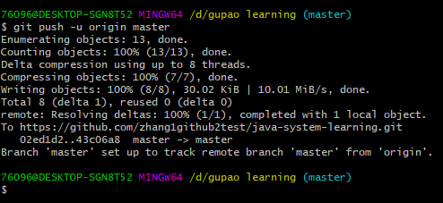

# git learning note

## 一、git 操作入门

1、`git init ` ：用来初始化一个git仓库

2、git status :用来显示工作树的状态。通常会展示你所在的分支名，修改或者新增的文件等。

当不知道该怎么操作的时候，执行`git status` 会提醒下步该如何操作。

> 显示在索引文件和当前头提交之间有差异的路径，在工作树和索引文件之间有差异的路径，以及在工作树中没有被Git跟踪(并且没有被gitignore忽略(5))的路径。第一个是通过运行git commit要提交的内容;第二个和第三个是在运行git提交之前可以通过运行git add提交的。

* 使用`git status` 查看状态

* 使用`git add`  添加未被版本管理的文件

  从上面的状态可以看出来，我们需要有一个文件被修改，一个文件夹没有被git进行版本管理。从提示中可以看出来我们需要使用`git add`  命令进行文件的添加。

* 使用`git commit  -m " note txt"` 命令来提交修改的文件到 工作区 

* 执行`git push -u origin master` 将本地文件推到远程仓库

  

3、`git clone` 

使用git clone命令，除了从远程仓库把`.git` 这个仓库目录下载到工作目录中，还会`checkout` (检出) `master`

二、git 版本的回退和qianjin

git reflog 来查看版本信息

git reset  想要去的版本号  

三、分支的操作

* 查看所有的分支：`git branch -v`

  

* 创建新的分支： `git branch [分支名]

  

* 切换分支： git checkout hot_fix   

  

* 合并分支：   （将分支代码合并到主干） 

  * 先切换到主干，   git checkout master

    

  * 然后合并   git merge bot_fix

    

* 解决冲突

  有时候发生合并分支的时候将会发生冲突

  

 查看文件，将其编辑为正确的内容。执行下git status .

根据提示，使用git add apple.txt 将已经解决好冲突的文件编辑进去

* 解决冲突的步骤：
  * 1、编辑文件，删除特殊符合，把文件修改到满意的程度，保存退出
  * 2、git add [文件名]
  * 3、 git commit -m "日志信息"
    * 此时git commit 一定不能带文件名

