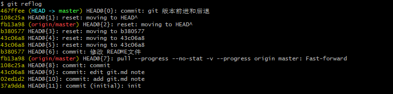

# git learning note

## 一、git 操作入门

1、`git init ` ：用来初始化一个git仓库

2、git status :用来显示工作树的状态。通常会展示你所在的分支名，修改或者新增的文件等。

当不知道该怎么操作的时候，执行`git status` 会提醒下步该如何操作。

> 显示在索引文件和当前头提交之间有差异的路径，在工作树和索引文件之间有差异的路径，以及在工作树中没有被Git跟踪(并且没有被gitignore忽略(5))的路径。第一个是通过运行git commit要提交的内容;第二个和第三个是在运行git提交之前可以通过运行git add提交的。

- 使用`git status` 查看状态

- 使用`git add`  添加未被版本管理的文件

  从上面的状态可以看出来，我们需要有一个文件被修改，一个文件夹没有被git进行版本管理。从提示中可以看出来我们需要使用`git add`  命令进行文件的添加。

- 使用`git commit  -m " note txt"` 命令来提交修改的文件到 工作区 

- 执行`git push -u origin master` 将本地文件推到远程仓库

  

3、`git clone` 

使用git clone命令，除了从远程仓库把`.git` 这个仓库目录下载到工作目录中，还会`checkout` (检出) `master`

二、版本的前进和后退

使用`git relfog ` 查看版本信息

