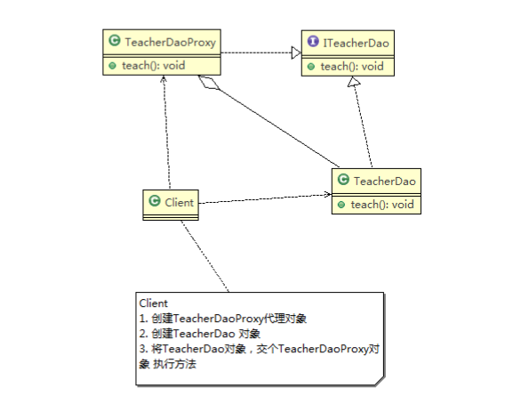

代理模式的基本介绍：

1)、代理模式：为一个对象提供一个替身，以控制对这个对象的访问。即通过代理对象访问目标对象。这样做的好处：

* 可以在目标对象实现的基础上，增强额外的功能操作，即扩展目标对象的能力。
* 被代理的对象可以式远程对象，创建开销大的对象或这需要安全控制的对象
* 分为静态代理和动态代理（JDK代理和CGlib代理）

###  一、静态代理

​	静态代理类图如下：



代理对象和被代理对象具有共同的父类(接口)。代理对象通过聚合持有被代理对象，在调用被代理的对象的方法前后可以做一些增强操作。

源码如下：

```java
//ITeacherDao  接口
public interface ITeacherDao {
    void teach();
}
```

```java
//被代理对象
public class TeacherDao implements ITeacherDao {
    @Override
    public void teach() {
        System.out.println("老师正式开始上课.....");
    }
}
```

```java
//代理对象
public class TeachDaoProxy implements ITeacherDao {
    private  ITeacherDao teacherDao;

    public TeachDaoProxy(ITeacherDao teacherDao) {
        this.teacherDao = teacherDao;
    }

    @Override
    public void teach() {
        System.out.println("上课前准备工作.....");
        teacherDao.teach();
        System.out.println("上课后清理工作.....");
    }
}
```

```
public class Client {
    public static void main(String[] args) {
        ITeacherDao teacherDao = new TeachDaoProxy(new TeacherDao());
        teacherDao.teach();
    }
}
```

### 二、动态代理

* JDK动态代理

  代理对象，不需要实现接口，但是目标对象要实现接口，否则不能实现动态代理

  代理对象的生成，是利用JDK的api，动态的在内存中构建对象

  `JDK`生成动态代理对象的API

  * 1)、代理类所在的包：`java.lang.reflect.Proxy` 

  * 2)、JDK实现动态代理只需要实现`newPoxyInstance` 方法，但是该方法需要接收三个参数，完整的写法为

    ```java
    Object newProxyInstance(ClassLoader loader,
                                              Class<?>[] interfaces,
                                              InvocationHandler h)
    ```

    

  

* CGLIB动态代理