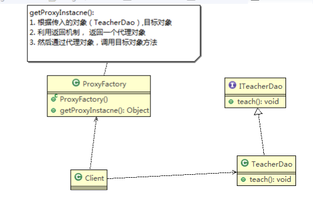
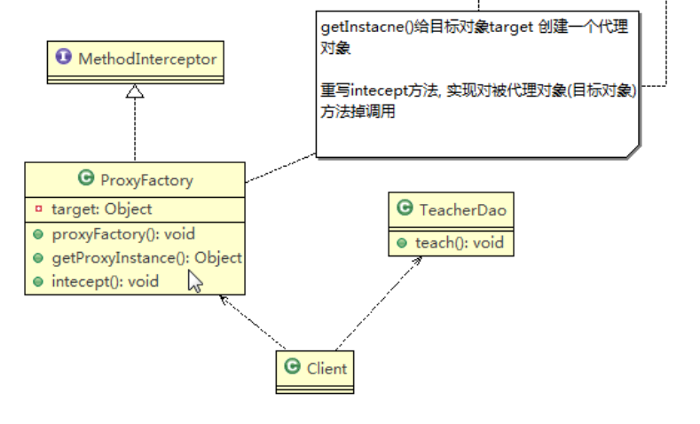

代理模式的基本介绍：

1)、代理模式：为一个对象提供一个替身，以控制对这个对象的访问。即通过代理对象访问目标对象。这样做的好处：

* 可以在目标对象实现的基础上，增强额外的功能操作，即扩展目标对象的能力。
* 被代理的对象可以式远程对象，创建开销大的对象或这需要安全控制的对象
* 分为静态代理和动态代理（JDK代理和CGlib代理）

###  一、静态代理

​	静态代理类图如下：


代理对象和被代理对象具有共同的父类(接口)。代理对象通过聚合持有被代理对象，在调用被代理的对象的方法前后可以做一些增强操作。

源码如下：

```java
//ITeacherDao  接口
public interface ITeacherDao {
    void teach();
}
```

```java
//被代理对象
public class TeacherDao implements ITeacherDao {
    @Override
    public void teach() {
        System.out.println("老师正式开始上课.....");
    }
}
```

```java
//代理对象
public class TeachDaoProxy implements ITeacherDao {
    private  ITeacherDao teacherDao;

    public TeachDaoProxy(ITeacherDao teacherDao) {
        this.teacherDao = teacherDao;
    }

    @Override
    public void teach() {
        System.out.println("上课前准备工作.....");
        teacherDao.teach();
        System.out.println("上课后清理工作.....");
    }
}
```

```
public class Client {
    public static void main(String[] args) {
        ITeacherDao teacherDao = new TeachDaoProxy(new TeacherDao());
        teacherDao.teach();
    }
}
```

### 二、动态代理

* JDK动态代理

  代理对象，不需要实现接口，但是目标对象要实现接口，否则不能实现动态代理

  代理对象的生成，是利用JDK的api，动态的在内存中构建对象

  `JDK`生成动态代理对象的API

  * 1)、代理类所在的包：`java.lang.reflect.Proxy` 

  * 2)、JDK实现动态代理只需要实现`newPoxyInstance` 方法，但是该方法需要接收三个参数，完整的写法为

    ```java
    Object newProxyInstance(ClassLoader loader,
                                              Class<?>[] interfaces,
                                              InvocationHandler h)
    ```

    

  ```java
  //ITeachDao接口  及被代理对象同静态代理
  ```

  ```java
  /**
   * 代理工厂类
   */
  public class ProxyFactory {
      private Object target;
  
      public ProxyFactory(Object target) {
          this.target = target;
      }
  
      /**
       * ClassLoader loader,  指定当前木匾对象使用的类加载器
       * Class<?>[] interfaces, 目标对象实现的接口类型，使用范型方法确认类型
       * InvocationHandler h：事件处理，执行目标的方法时，会触发时间处理器的方法
       * @return
       */
      public Object getProxyInstance(){
          return Proxy.newProxyInstance(target.getClass().getClassLoader(), target.getClass().getInterfaces(), new InvocationHandler() {
              @Override
              public Object invoke(Object proxy, Method method, Object[] args) throws Throwable {
                  System.out.println("使用JDK动态代理...方法调用前");
                  //利用反射调用目标对象的方法
                  Object invoke = method.invoke(target, args);
                  System.out.println("使用JDK动态代理...方法调用后");
                  return invoke;
              }
          });
      }
  }
  
  ```

  ```java
  //client调用
  public class DynamicClient {
      public static void main(String[] args) {
          ITeacherDao teacherDao = new TeacherDao();
          ITeacherDao proxyInstance  = (ITeacherDao) new ProxyFactory(teacherDao).getProxyInstance();
          System.out.println("proxyInstance =" + proxyInstance.getClass());
          proxyInstance.teach();
  
      }
  }
  ```

  

* CGLIB动态代理

  * 静态代理和CGlib代理都要求目标对象实现一个接口，但是有时候目标对象只有一个单独的对象，并没有实现任何的接口，这个时候可以使用目标子类来实现代理。此种代理模式就是为CGLIB代理。

  * CGLI是一个清大的高性能代码生成包，它可以在运行期扩展java类与实现java接口。它广泛的被许多AOP的框架使用。例如spring的AOP,实现方法拦截。

  * CGlib包的底层是通过使用字节码处理框架来转换字节码并生成新的类

  * 在内存中构建子类，注意被代理的类不能为final，否则会报错

  * 目标对象的方法如果为final/static，那么就不会拦截，即不会执行目标对象的额外业务方法。

    

```java
//被代理对象
public class TeacherDao implements ITeacherDao {
    @Override
    public void teach() {
        System.out.println("老师正式开始上课.....");
    }
}
```

```java
//代理工厂
package cn.szyrm.pattern.proxy;

import net.sf.cglib.proxy.Enhancer;
import net.sf.cglib.proxy.MethodInterceptor;
import net.sf.cglib.proxy.MethodProxy;

import java.lang.reflect.Method;

public class CGLibProxyFactory  implements MethodInterceptor {
    private Object target;

    public CGLibProxyFactory(Object target) {
        this.target = target;
    }

    /**
     *
     * @return
     */
   public Object getProxyInstance(){
       Enhancer enhancer = new Enhancer();
       enhancer.setSuperclass(target.getClass());
       enhancer.setCallback(this);
       enhancer.create();
        return  enhancer;
    }

    @Override
    public Object intercept(Object o, Method method, Object[] objects, MethodProxy methodProxy) throws Throwable {
        System.out.println("cglib代理开始.......");
        Object invoke = method.invoke(target, objects);
        System.out.println("cglib代理结束.......");
        return invoke;
    }
} 

```

```java
public class CglibClient {
    public static void main(String[] args) {
        CGLibProxyFactory cgLibProxyFactory = new CGLibProxyFactory(new TeacherDao());
        TeacherDao proxyInstance = (TeacherDao) cgLibProxyFactory.getProxyInstance();

        proxyInstance.teach();
    }
}
```

